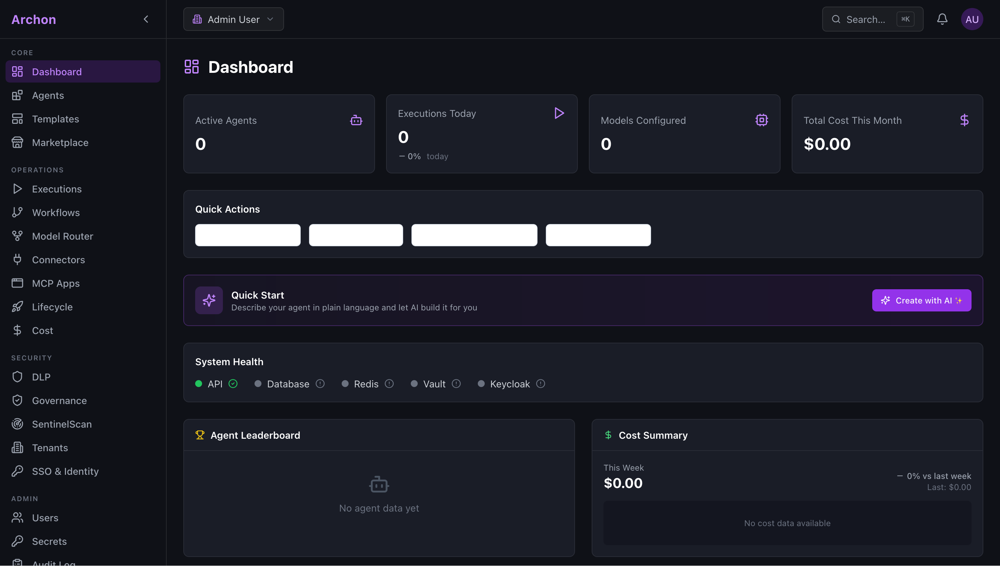
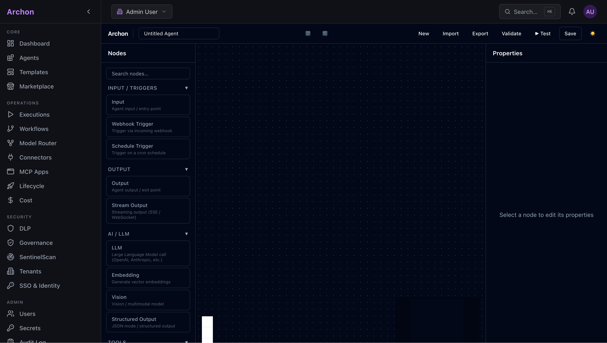
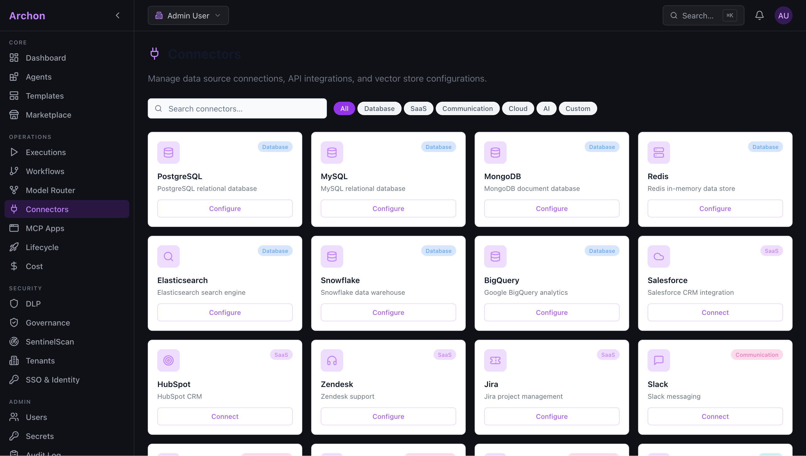
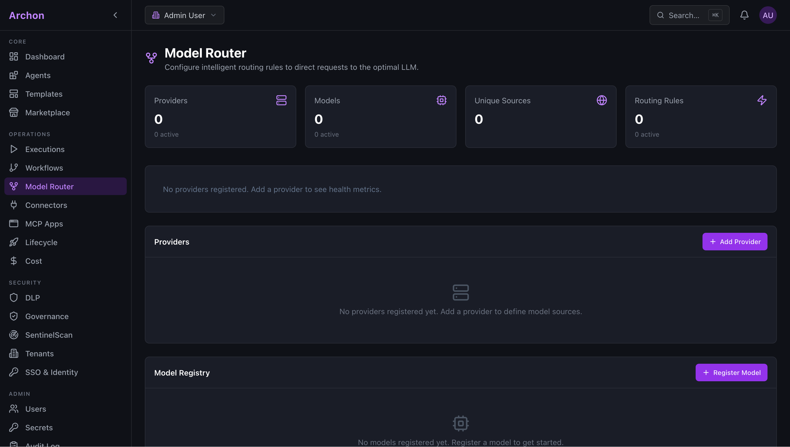
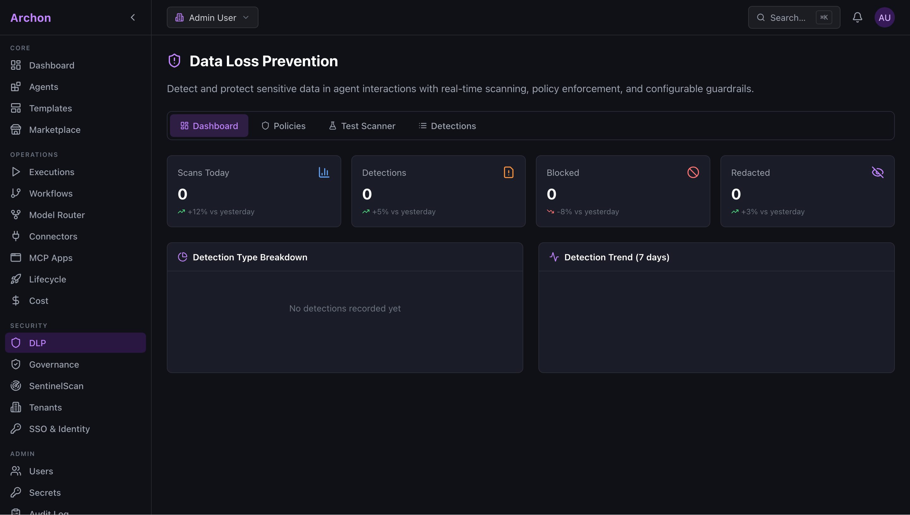

<div align="center">

# ⬡ Archon

### Enterprise-Grade AI Orchestration Platform

Build, deploy, and govern AI agents at scale — with a visual canvas, intelligent model routing, enterprise security, and 50+ data connectors.

[](LICENSE)
[](https://python.org)
[](https://react.dev)
[](https://fastapi.tiangolo.com)
[](https://typescriptlang.org)

<br/>



</div>

---

## Overview

Archon is a self-hosted AI orchestration and governance platform for teams that need full control over their AI infrastructure. It replaces fragmented tooling with a single platform for building agent workflows, managing model providers, enforcing data loss prevention policies, and monitoring costs — all behind your firewall.

### Why Archon?

- **No vendor lock-in** — Model-agnostic across OpenAI, Anthropic, Google, Mistral, Cohere, and local models (Ollama, vLLM, LiteLLM)
- **Visual-first** — Drag-and-drop agent builder with 27+ node types, no code required
- **Enterprise security** — DLP scanning, guardrails, RBAC/ABAC, SSO, audit logging, multi-tenancy
- **Self-hosted** — Deploy on-prem, air-gapped, or in your cloud with Kubernetes + Helm + Terraform
- **Full observability** — Real-time cost tracking, execution monitoring, and model health dashboards

---

## Features

### 🎨 Visual Agent Builder

Build AI workflows by dragging and connecting nodes on a canvas. Supports LLM calls, tool execution, branching logic, parallel processing, RAG retrieval, DLP scanning, and human-in-the-loop approval gates.



<br/>

### 🔌 50+ Data Connectors

Connect to databases (PostgreSQL, MySQL, MongoDB, Snowflake, BigQuery), SaaS platforms (Salesforce, Jira, HubSpot, Zendesk), communication tools (Slack, Teams), cloud storage (S3, Azure Blob), and custom REST/GraphQL APIs.



<br/>

### 🧭 Intelligent Model Router

Register multiple LLM providers, define routing rules based on capability, cost, latency, or tenant tier, and configure automatic fallback chains. Monitor provider health with real-time latency and error tracking.



<br/>

### 🛡️ Data Loss Prevention & Security

Scan agent inputs and outputs for PII, credentials, and sensitive data in real time. Define policies with configurable actions (redact, mask, block, alert) and sensitivity levels. Full audit trail for compliance.



<br/>

### 📊 Operations Dashboard

Monitor active agents, execution throughput, model usage, and costs from a single pane. System health indicators for API, database, cache, vault, and identity services. Agent leaderboard and activity feed.


---

## Architecture

```
archon/
├── frontend/          React 19 · TypeScript · React Flow · shadcn/ui
├── backend/           FastAPI · Python 3.12 · SQLModel · Alembic
├── agents/            LangGraph state machines · 17 specialized agents
├── security/          Guardrails · DLP engine · Red-teaming
├── integrations/      50+ connectors · REST/GraphQL SDK
├── ops/               Routing engine · Cost tracker · Monitoring
├── data/              RAG pipeline · LlamaIndex · Unstructured.io
├── infra/             Terraform · Helm · Kubernetes manifests
├── mobile/            Flutter SDK · iOS/Android native
└── tests/             Unit · Integration · E2E test suite
```

## Tech Stack

| Layer | Technology |
|:------|:-----------|
| **Frontend** | React 19 · TypeScript · React Flow · shadcn/ui · Tailwind CSS · Monaco Editor |
| **Backend** | FastAPI · SQLModel · Alembic · Celery · Python 3.12 |
| **Orchestration** | LangGraph · LangChain · CrewAI patterns |
| **Vector / RAG** | PGVector · LlamaIndex · Unstructured · Haystack |
| **Security** | OPA · Guardrails AI · NeMo Guardrails · HashiCorp Vault |
| **Monitoring** | Prometheus · Grafana · OpenTelemetry · OpenSearch |
| **Deployment** | Kubernetes · ArgoCD · Helm · Kyverno · Cert-Manager |
| **Auth** | Keycloak · OAuth 2.0 · OIDC · RBAC / ABAC |
| **Cost Tracking** | Custom token tracker · OpenLLMetry |

---

## Quick Start

### Prerequisites

- Docker & Docker Compose
- Node.js 20+ and Python 3.12+
- Git

### Development Setup

```bash
# Clone the repository
git clone https://github.com/schwarztim/archon.git
cd archon

# Copy environment template
cp env.example .env

# Start infrastructure (Postgres + Redis)
make dev

# Install and run the backend
pip install -r backend/requirements.txt
cd backend && uvicorn app.main:app --reload --port 8000

# Install and run the frontend (separate terminal)
cd frontend && npm install && npm run dev
```

### Full Stack (Docker)

```bash
# Start all services
make up

# Run database migrations
make migrate

# View logs
make logs
```

### Enterprise Mode (Vault + Keycloak)

```bash
# Start with full enterprise services
make dev-enterprise

# Initialize secrets
make secrets-init
```

---

## Project Structure

| Directory | Description |
|:----------|:------------|
| `frontend/` | React SPA — agent builder, dashboards, admin UI |
| `backend/` | FastAPI REST API — agents, models, executions, auth |
| `agents/` | Agent definitions and LangGraph state machines |
| `security/` | DLP engine, guardrails, red-team testing |
| `integrations/` | Data connectors and SDK |
| `ops/` | Model router, cost engine, monitoring |
| `data/` | RAG pipeline and document processing |
| `infra/` | Terraform modules, Helm charts, K8s manifests |
| `mobile/` | Flutter mobile SDK |
| `scripts/` | Utility and deployment scripts |
| `docs/` | Architecture docs and API reference |

---

## Documentation

| Document | Description |
|:---------|:------------|
| [Architecture](docs/ARCHITECTURE.md) | System design, component interactions, data flow |
| [Instructions](INSTRUCTIONS.md) | Project guidelines and development standards |
| [Roadmap](ROADMAP.md) | Feature roadmap and release milestones |
| [Contributing](docs/CONTRIBUTING.md) | How to contribute — issues, PRs, code style |

---

## Contributing

Contributions are welcome. Please read [CONTRIBUTING.md](docs/CONTRIBUTING.md) before submitting a pull request.

1. Fork the repository
2. Create a feature branch (`git checkout -b feature/your-feature`)
3. Commit your changes (`git commit -m 'feat: add your feature'`)
4. Push to your branch (`git push origin feature/your-feature`)
5. Open a Pull Request

---

## License

Licensed under the [Apache License 2.0](LICENSE).

---

<div align="center">
<sub>Built with ⬡ by the Archon team</sub>
</div>
