# Agent Dependency Graph — Archon Build Swarm

> 26 specialized agents + 1 Master Validator organized in 7 phases.
> Source: `agents/SWARM_OVERVIEW.md`

## Phase Overview

```mermaid
graph LR
    P0["Phase 0\nFoundation"]
    P1["Phase 1\nCore (01-06)"]
    P2["Phase 2\nOps (07-09, 23)"]
    P3["Phase 3\nSecurity (10-12, 18, 20, 21)"]
    P4["Phase 4\nData (13, 14, 19)"]
    P5["Phase 5\nDeploy (15-17, 22)"]
    P6["Phase 6\nAdvanced (24, 25)"]
    P7["Phase 7\nValidate (MV)"]

    P0 --> P1
    P1 --> P2
    P2 --> P3
    P3 --> P4
    P4 --> P5
    P5 --> P6
    P6 --> P7

    style P0 fill:#e91e63,color:#fff
    style P1 fill:#2196f3,color:#fff
    style P2 fill:#ff9800,color:#fff
    style P3 fill:#f44336,color:#fff
    style P4 fill:#4caf50,color:#fff
    style P5 fill:#9c27b0,color:#fff
    style P6 fill:#00bcd4,color:#fff
    style P7 fill:#795548,color:#fff
```



## Full Dependency Graph

```mermaid
graph TD
    %% Phase 0 - Foundation
    A00["Agent-00\nSecrets Vault\n(Phase 0)"]

    %% Phase 1 - Core
    A01["Agent-01\nCore Backend +\nEnterprise Identity\n(Phase 1)"]
    A02["Agent-02\nUI Builder +\nEnterprise Frontend\n(Phase 1)"]
    A03["Agent-03\nNL Wizard\n(Auth-Aware)\n(Phase 1)"]
    A04["Agent-04\nTemplate Curator +\nMarketplace Auth\n(Phase 1)"]
    A05["Agent-05\nSandbox + Arena +\nSecrets Injection\n(Phase 1)"]
    A06["Agent-06\nVersion Control +\nSigned Versions\n(Phase 1)"]

    %% Phase 2 - Ops
    A07["Agent-07\nIntelligent Router +\nAuth-Aware Routing\n(Phase 2)"]
    A08["Agent-08\nLifecycle Manager +\nCredential Rotation\n(Phase 2)"]
    A09["Agent-09\nCost Engine +\nIdentity Attribution\n(Phase 2)"]
    A23["Agent-23\nMulti-Tenant +\nPer-Tenant IdP\n(Phase 2)"]

    %% Phase 3 - Security
    A10["Agent-10\nRed-Team +\nAuth Bypass Testing\n(Phase 3)"]
    A11["Agent-11\nDLP + Credential\nScanning + NL Policy\n(Phase 3)"]
    A12["Agent-12\nGovernance +\nIdentity Governance\n(Phase 3)"]
    A18["Agent-18\nSentinelScan +\nSSO Discovery\n(Phase 3)"]
    A20["Agent-20\nMCP Security +\nTool-Level OAuth\n(Phase 3)"]
    A21["Agent-21\nSecurity Proxy +\nSAML Termination\n(Phase 3)"]

    %% Phase 4 - Data
    A13["Agent-13\nConnector Hub +\nFull OAuth Flows\n(Phase 4)"]
    A14["Agent-14\nDocForge +\nEncrypted Embeddings\n(Phase 4)"]
    A19["Agent-19\nA2A Protocol +\nFederated OAuth\n(Phase 4)"]

    %% Phase 5 - Deploy
    A15["Agent-15\nLive Components +\nSession-Bound Auth\n(Phase 5)"]
    A16["Agent-16\nMobile SDK +\nBiometric/SAML Auth\n(Phase 5)"]
    A17["Agent-17\nDeployment + Vault\nOperator + Cert-Manager\n(Phase 5)"]
    A22["Agent-22\nMarketplace +\nPublisher Auth\n(Phase 5)"]

    %% Phase 6 - Advanced
    A24["Agent-24\nFederated Agent Mesh +\nFederated Identity\n(Phase 6)"]
    A25["Agent-25\nEdge Runtime +\nOffline Auth\n(Phase 6)"]

    %% Phase 7 - Validate
    MV["Master Validator\nE2E Testing +\nEnterprise Auth\nVerification\n(Phase 7)"]

    %% ===== DEPENDENCIES =====

    %% Agent-00 is universal dependency
    A00 --> A01

    %% Phase 1 all depend on Agent-01
    A01 --> A02
    A01 --> A03
    A01 --> A05
    A01 --> A06
    A01 --> A07
    A01 --> A13
    A01 --> A16

    %% Agent-02 dependencies
    A02 --> A04
    A02 --> A12
    A02 --> A15
    A02 --> A22

    %% Phase 2 from Agent-07
    A07 --> A08
    A07 --> A09
    A07 --> A11
    A07 --> A21

    %% Phase 3 cross-deps
    A05 --> A10
    A09 --> A23
    A12 --> A18
    A11 --> A20
    A15 --> A20
    A07 --> A19
    A13 --> A19
    A13 --> A14

    %% Phase 5 - Deployment depends on all
    A17 -.->|"depends on ALL agents"| A01

    %% Phase 6 depends on Phase 5
    A17 --> A24
    A17 --> A25

    %% Master Validator depends on Phase 6
    A24 --> MV
    A25 --> MV

    %% Styling
    style A00 fill:#e91e63,color:#fff,stroke:#b71c1c
    style A01 fill:#2196f3,color:#fff
    style A02 fill:#2196f3,color:#fff
    style A03 fill:#2196f3,color:#fff
    style A04 fill:#2196f3,color:#fff
    style A05 fill:#2196f3,color:#fff
    style A06 fill:#2196f3,color:#fff
    style A07 fill:#ff9800,color:#fff
    style A08 fill:#ff9800,color:#fff
    style A09 fill:#ff9800,color:#fff
    style A23 fill:#ff9800,color:#fff
    style A10 fill:#f44336,color:#fff
    style A11 fill:#f44336,color:#fff
    style A12 fill:#f44336,color:#fff
    style A18 fill:#f44336,color:#fff
    style A20 fill:#f44336,color:#fff
    style A21 fill:#f44336,color:#fff
    style A13 fill:#4caf50,color:#fff
    style A14 fill:#4caf50,color:#fff
    style A19 fill:#4caf50,color:#fff
    style A15 fill:#9c27b0,color:#fff
    style A16 fill:#9c27b0,color:#fff
    style A17 fill:#9c27b0,color:#fff
    style A22 fill:#9c27b0,color:#fff
    style A24 fill:#00bcd4,color:#fff
    style A25 fill:#00bcd4,color:#fff
    style MV fill:#795548,color:#fff
```



## Agent Registry

| ID | Name | Phase | Role | Backend Route | Service |
|----|------|-------|------|---------------|---------|
| 00 | Secrets Vault | 0 | Vault integration, rotation, PKI | secrets | SecretAccessLogger |
| 01 | Core Backend + Identity | 1 | FastAPI + OAuth/SAML/SCIM/MFA/RBAC + LangGraph | agents, executions, auth_routes | AgentService, ExecutionService, AuthService |
| 02 | UI Builder + Frontend | 1 | React Flow canvas + SSO login + RBAC UI | — (frontend) | — |
| 03 | NL Wizard | 1 | Natural language → agent (secrets-aware) | wizard | NLWizardService |
| 04 | Template Curator | 1 | Template library with credential manifests | templates | TemplateService |
| 05 | Sandbox + Arena | 1 | Isolated testing with dynamic Vault secrets | sandbox | SandboxService |
| 06 | Version Control | 1 | Git-like versioning with secrets tracking | versioning | VersioningService |
| 07 | Intelligent Router | 2 | Dynamic model routing with Vault credentials | router | ModelRouterService, RoutingEngine |
| 08 | Lifecycle Manager | 2 | Deployment strategies with Vault integration | lifecycle | LifecycleService |
| 09 | Cost Engine | 2 | Token ledger with per-user/tenant attribution | cost | CostService, CostEngine |
| 10 | Red-Team | 3 | Adversarial testing including auth attacks | redteam | RedTeamService |
| 11 | DLP Guardrails | 3 | DLP with Vault-aware redaction | dlp | DLPEngine, DLPService |
| 12 | Governance | 3 | Compliance + access reviews + risk | governance | GovernanceService, GovernanceEngine |
| 13 | Connector Hub | 4 | 60+ connectors with Vault credential storage | connectors | ConnectorService, OAuthProviderRegistry |
| 14 | DocForge | 4 | Document processing with auth-gated access | docforge | DocForgeService |
| 15 | Live Components | 5 | Embedded UIs with component-level RBAC | mcp_interactive | MCPInteractiveService |
| 16 | Mobile SDK | 5 | Flutter SDK with biometric/SAML auth | mobile | MobileService |
| 17 | Deployment | 5 | K8s + Terraform + Vault Operator + Cert-Manager | deployment | DeploymentService |
| 18 | SentinelScan | 3 | Shadow AI discovery via SSO log analysis | sentinelscan | SentinelScanService |
| 19 | A2A Protocol | 4 | Agent-to-Agent with mTLS + OAuth federation | a2a | A2AService, A2AClient, A2APublisher |
| 20 | MCP Security | 3 | MCP governance with Vault integration | mcp_security | MCPSecurityGuardian, MCPSecurityService |
| 21 | Security Proxy | 3 | AI security proxy with credential injection | security_proxy | SecurityProxyService |
| 22 | Marketplace | 5 | Open marketplace with license enforcement | marketplace | MarketplaceService |
| 23 | Multi-Tenant | 2 | Tenant isolation + SCIM + Vault namespaces | tenancy, tenants | TenantService, TenancyService |
| 24 | Federated Mesh | 6 | Cross-org collaboration with Vault isolation | mesh | MeshService |
| 25 | Edge Runtime | 6 | Offline-first with device-bound auth | edge | EdgeService |
| MV | Master Validator | 7 | E2E testing + enterprise auth verification | — (test harness) | — |

## Critical Path

```
Agent-00 → Agent-01 → Agent-07 → Agent-08/09/11/21 → Agent-17 → Agent-24/25 → Master Validator
```

The longest dependency chain runs through: Foundation → Core → Router → Ops/Security → Deployment → Advanced → Validation.
