# C4 Component Diagram — Backend API

> Level 3 C4 diagram showing the Backend API internal components grouped by domain.

```mermaid
graph TB
    subgraph "Middleware Stack"
        MW_CORS["CORS"]
        MW_METRICS["MetricsMiddleware"]
        MW_TENANT["TenantMiddleware"]
        MW_DLP["DLPMiddleware"]
        MW_AUDIT["AuditMiddleware"]
        MW_AUTH["Auth (JWT/Keycloak)"]
        MW_RBAC["RBAC"]
    end

    subgraph "Core Domain"
        direction TB
        R_AGENTS["agents\n/agents"]
        R_AGENT_VERS["agent_versions\n/agent-versions"]
        R_EXEC["executions\n/executions"]
        R_WIZARD["wizard\n/wizard"]
        R_TEMPLATES["templates\n/templates"]
        R_SANDBOX["sandbox\n/sandbox"]
        R_VERSIONING["versioning\n/versioning"]
        R_WORKFLOWS["workflows\n/workflows"]
        R_MODELS["models\n/models"]

        S_AGENT["AgentService"]
        S_AGENT_VER["AgentVersionService"]
        S_EXEC["ExecutionService"]
        S_WIZARD["NLWizardService"]
        S_TEMPLATE["TemplateService"]
        S_SANDBOX["SandboxService"]
        S_VERSION["VersioningService"]
        S_WORKFLOW["WorkflowEngine"]
        S_MODEL["ModelService"]
        S_LANGGRAPH["LangGraph Engine"]

        M_AGENT["Agent"]
        M_EXEC["Execution"]
        M_AGENT_VER["AgentVersion"]
        M_TEMPLATE["Template"]
        M_MODEL["Model"]
        M_WIZARD["WizardSession"]

        R_AGENTS --> S_AGENT
        R_AGENT_VERS --> S_AGENT_VER
        R_EXEC --> S_EXEC
        R_WIZARD --> S_WIZARD
        R_TEMPLATES --> S_TEMPLATE
        R_SANDBOX --> S_SANDBOX
        R_VERSIONING --> S_VERSION
        R_WORKFLOWS --> S_WORKFLOW
        R_MODELS --> S_MODEL
        S_EXEC --> S_LANGGRAPH

        S_AGENT --> M_AGENT
        S_EXEC --> M_EXEC
        S_AGENT_VER --> M_AGENT_VER
        S_TEMPLATE --> M_TEMPLATE
        S_MODEL --> M_MODEL
    end

    subgraph "Security Domain"
        direction TB
        R_AUTH["auth_routes\n/api/v1/auth"]
        R_SAML["saml\n/api/v1/saml"]
        R_SSO["sso\n/api/v1/sso"]
        R_SSO_CFG["sso_config\n/api/v1 (SSO & RBAC)"]
        R_SCIM["scim\n/api/v1/scim/v2"]
        R_SECRETS["secrets\n/api/v1 (Secrets)"]
        R_REDTEAM["redteam\n/api/v1/redteam"]
        R_MCP_SEC["mcp_security\n/mcp-security"]
        R_SEC_PROXY["security_proxy\n/api/v1/proxy"]
        R_DLP["dlp\n/dlp"]

        S_AUTH["AuthService"]
        S_SAML["SAMLService"]
        S_SCIM["SCIMService"]
        S_REDTEAM["RedTeamService"]
        S_MCP_SEC["MCPSecurityGuardian\nMCPSecurityService"]
        S_SEC_PROXY["SecurityProxyService"]
        S_DLP["DLPEngine\nDLPService"]
        S_SECRET_LOG["SecretAccessLogger"]

        M_AUTH["UserIdentity\nUserRole\nAPIKey\nSAMLProvider"]
        M_MCP_SEC["MCPToolAuthorization\nMCPSandboxSession\nMCPSecurityEvent\nMCPToolVersion"]
        M_DLP["DLPPolicy\nDLPScanResult\nDLPDetectedEntity"]
        M_SECRETS["SecretRegistration\nSecretAccessLog"]
        M_SEC_PROXY["ProxySession\nUpstreamConfig"]

        R_AUTH --> S_AUTH
        R_SAML --> S_SAML
        R_SCIM --> S_SCIM
        R_REDTEAM --> S_REDTEAM
        R_MCP_SEC --> S_MCP_SEC
        R_SEC_PROXY --> S_SEC_PROXY
        R_DLP --> S_DLP
        R_SECRETS --> S_SECRET_LOG

        S_AUTH --> M_AUTH
        S_SAML --> M_AUTH
        S_MCP_SEC --> M_MCP_SEC
        S_DLP --> M_DLP
        S_SECRET_LOG --> M_SECRETS
    end

    subgraph "Governance & Compliance"
        direction TB
        R_GOV["governance\n/governance"]
        R_AUDIT["audit_logs\n/audit/logs"]
        R_SENTINEL["sentinelscan\n/sentinelscan"]

        S_GOV["GovernanceService\nGovernanceEngine"]
        S_AUDIT["AuditLogService"]
        S_SENTINEL["SentinelScanService"]

        M_GOV["CompliancePolicy\nComplianceRecord\nAuditEntry\nAgentRegistryEntry\nApprovalRequest"]
        M_AUDIT["EnterpriseAuditEvent\nAuditLog"]
        M_SENTINEL["DiscoveryScan\nDiscoveredService\nRiskClassification"]

        R_GOV --> S_GOV
        R_AUDIT --> S_AUDIT
        R_SENTINEL --> S_SENTINEL

        S_GOV --> M_GOV
        S_AUDIT --> M_AUDIT
        S_SENTINEL --> M_SENTINEL
    end

    subgraph "Integration Domain"
        direction TB
        R_CONNECTORS["connectors\n/connectors"]
        R_A2A["a2a\n/a2a"]
        R_MCP["mcp\n/mcp"]
        R_MCP_INT["mcp_interactive\n/api/v1/components"]
        R_MESH["mesh\n/mesh"]
        R_EDGE["edge\n/edge"]
        R_DOCFORGE["docforge\n/docforge"]
        R_MOBILE["mobile\n/api/v1/mobile"]
        R_MARKETPLACE["marketplace\n/marketplace"]

        S_CONNECTOR["ConnectorService\nHealthChecker\nConnectionTester\nOAuthProviderRegistry"]
        S_A2A["A2AService\nA2AClient\nA2APublisher"]
        S_MCP["MCPService"]
        S_MCP_INT["MCPInteractiveService"]
        S_MESH["MeshService"]
        S_EDGE["EdgeService"]
        S_DOCFORGE["DocForgeService"]
        S_MOBILE["MobileService"]
        S_MARKETPLACE["MarketplaceService"]

        M_CONNECTOR["Connector"]
        M_A2A["A2AAgentCard\nA2AMessage\nA2ATask"]
        M_MCP["MCPComponent\nMCPSession\nMCPInteraction"]
        M_MESH["MeshNode\nTrustRelationship\nMeshMessage\nFederationConfig"]
        M_EDGE["EdgeDevice\nEdgeModelDeployment\nEdgeSyncRecord\nFleetConfig"]
        M_DOCFORGE["DocForgeDocument"]
        M_MARKETPLACE["CreatorProfile\nMarketplaceListing\nMarketplaceReview\nMarketplaceInstall"]

        R_CONNECTORS --> S_CONNECTOR
        R_A2A --> S_A2A
        R_MCP --> S_MCP
        R_MCP_INT --> S_MCP_INT
        R_MESH --> S_MESH
        R_EDGE --> S_EDGE
        R_DOCFORGE --> S_DOCFORGE
        R_MOBILE --> S_MOBILE
        R_MARKETPLACE --> S_MARKETPLACE

        S_CONNECTOR --> M_CONNECTOR
        S_A2A --> M_A2A
        S_MCP --> M_MCP
        S_MCP_INT --> M_MCP
        S_MESH --> M_MESH
        S_EDGE --> M_EDGE
        S_DOCFORGE --> M_DOCFORGE
        S_MARKETPLACE --> M_MARKETPLACE
    end

    subgraph "Infrastructure Domain"
        direction TB
        R_DEPLOY["deployment\n/api/v1/deploy"]
        R_LIFECYCLE["lifecycle\n/lifecycle"]
        R_COST["cost\n/cost"]
        R_ROUTER["router\n/router"]
        R_TENANCY["tenancy\n/tenants"]
        R_TENANTS["tenants\n/api/v1/tenancy"]
        R_ADMIN["admin\n/admin"]
        R_SETTINGS["settings\n/settings"]

        S_DEPLOY["DeploymentService"]
        S_LIFECYCLE["LifecycleService"]
        S_COST["CostService\nCostEngine"]
        S_ROUTER_SVC["ModelRouterService\nRoutingEngine\nModelRegistry\nRoutingRuleService"]
        S_TENANT["TenantService"]
        S_TENANCY["TenancyService"]

        M_DEPLOY["DeploymentRecord"]
        M_LIFECYCLE["DeploymentRecord\nHealthCheck\nLifecycleEvent"]
        M_COST["TokenLedger\nProviderPricing\nBudget\nCostAlert"]
        M_ROUTER["RoutingRule\nModelRegistryEntry"]
        M_TENANT["Tenant\nTenantQuota\nUsageMeteringRecord\nBillingRecord\nTenantConfiguration"]
        M_SETTINGS["PlatformSetting\nFeatureFlag\nSettingsAPIKey"]

        R_DEPLOY --> S_DEPLOY
        R_LIFECYCLE --> S_LIFECYCLE
        R_COST --> S_COST
        R_ROUTER --> S_ROUTER_SVC
        R_TENANCY --> S_TENANCY
        R_TENANTS --> S_TENANT
        R_ADMIN --> S_TENANT

        S_DEPLOY --> M_DEPLOY
        S_LIFECYCLE --> M_LIFECYCLE
        S_COST --> M_COST
        S_ROUTER_SVC --> M_ROUTER
        S_TENANT --> M_TENANT
        S_TENANCY --> M_TENANT
    end

    classDef route fill:#4a90d9,stroke:#333,color:#fff
    classDef service fill:#7cb342,stroke:#333,color:#fff
    classDef model fill:#ff8f00,stroke:#333,color:#fff
    classDef middleware fill:#ab47bc,stroke:#333,color:#fff

    class R_AGENTS,R_AGENT_VERS,R_EXEC,R_WIZARD,R_TEMPLATES,R_SANDBOX,R_VERSIONING,R_WORKFLOWS,R_MODELS route
    class R_AUTH,R_SAML,R_SSO,R_SSO_CFG,R_SCIM,R_SECRETS,R_REDTEAM,R_MCP_SEC,R_SEC_PROXY,R_DLP route
    class R_GOV,R_AUDIT,R_SENTINEL route
    class R_CONNECTORS,R_A2A,R_MCP,R_MCP_INT,R_MESH,R_EDGE,R_DOCFORGE,R_MOBILE,R_MARKETPLACE route
    class R_DEPLOY,R_LIFECYCLE,R_COST,R_ROUTER,R_TENANCY,R_TENANTS,R_ADMIN,R_SETTINGS route

    class S_AGENT,S_AGENT_VER,S_EXEC,S_WIZARD,S_TEMPLATE,S_SANDBOX,S_VERSION,S_WORKFLOW,S_MODEL,S_LANGGRAPH service
    class S_AUTH,S_SAML,S_SCIM,S_REDTEAM,S_MCP_SEC,S_SEC_PROXY,S_DLP,S_SECRET_LOG service
    class S_GOV,S_AUDIT,S_SENTINEL service
    class S_CONNECTOR,S_A2A,S_MCP,S_MCP_INT,S_MESH,S_EDGE,S_DOCFORGE,S_MOBILE,S_MARKETPLACE service
    class S_DEPLOY,S_LIFECYCLE,S_COST,S_ROUTER_SVC,S_TENANT,S_TENANCY service

    class M_AGENT,M_EXEC,M_AGENT_VER,M_TEMPLATE,M_MODEL,M_WIZARD model
    class M_AUTH,M_MCP_SEC,M_DLP,M_SECRETS,M_SEC_PROXY model
    class M_GOV,M_AUDIT,M_SENTINEL model
    class M_CONNECTOR,M_A2A,M_MCP,M_MESH,M_EDGE,M_DOCFORGE,M_MARKETPLACE model
    class M_DEPLOY,M_LIFECYCLE,M_COST,M_ROUTER,M_TENANT,M_SETTINGS model

    class MW_CORS,MW_METRICS,MW_TENANT,MW_DLP,MW_AUDIT,MW_AUTH,MW_RBAC middleware
```

## Domain Summary

| Domain | Routes | Services | SQLModel Tables |
|--------|--------|----------|-----------------|
| **Core** | agents, agent_versions, executions, wizard, templates, sandbox, versioning, workflows, models | AgentService, AgentVersionService, ExecutionService, NLWizardService, TemplateService, SandboxService, VersioningService, WorkflowEngine, ModelService, LangGraph Engine | Agent, Execution, AgentVersion, Template, Model |
| **Security** | auth_routes, saml, sso, sso_config, scim, secrets, redteam, mcp_security, security_proxy, dlp | AuthService, SAMLService, SCIMService, RedTeamService, MCPSecurityGuardian, MCPSecurityService, SecurityProxyService, DLPEngine, DLPService, SecretAccessLogger | UserIdentity, UserRole, APIKey, SAMLProvider, MCPToolAuthorization, MCPSandboxSession, MCPSecurityEvent, MCPToolVersion, MCPResponseValidation, DLPPolicy, DLPScanResult, DLPDetectedEntity, SecretRegistration, SecretAccessLog |
| **Governance** | governance, audit_logs, sentinelscan | GovernanceService, GovernanceEngine, AuditLogService, SentinelScanService | CompliancePolicy, ComplianceRecord, AuditEntry, AgentRegistryEntry, ApprovalRequest, EnterpriseAuditEvent, AuditLog, DiscoveryScan, DiscoveredService, RiskClassification |
| **Integration** | connectors, a2a, mcp, mcp_interactive, mesh, edge, docforge, mobile, marketplace | ConnectorService, A2AService, A2AClient, A2APublisher, MCPService, MCPInteractiveService, MeshService, EdgeService, DocForgeService, MobileService, MarketplaceService | Connector, A2AAgentCard, A2AMessage, A2ATask, MCPComponent, MCPSession, MCPInteraction, MeshNode, TrustRelationship, MeshMessage, FederationConfig, EdgeDevice, EdgeModelDeployment, EdgeSyncRecord, FleetConfig, CreatorProfile, MarketplaceListing, MarketplaceReview, MarketplaceInstall |
| **Infrastructure** | deployment, lifecycle, cost, router, tenancy, tenants, admin, settings | DeploymentService, LifecycleService, CostService, CostEngine, ModelRouterService, RoutingEngine, ModelRegistry, RoutingRuleService, TenantService, TenancyService | DeploymentRecord, HealthCheck, LifecycleEvent, TokenLedger, ProviderPricing, Budget, CostAlert, RoutingRule, ModelRegistryEntry, Tenant, TenantQuota, UsageMeteringRecord, BillingRecord, TenantConfiguration, PlatformSetting, FeatureFlag, SettingsAPIKey |

## Route Module → API Prefix Mapping

| Route Module | API Prefix | Tags |
|-------------|-----------|------|
| agents | /api/agents | agents |
| agent_versions | /api/agent-versions | agent-versions |
| audit_logs | /api/audit/logs | audit-logs |
| connectors | /api/connectors | connectors |
| executions | /api/executions | executions |
| models | /api/models | models |
| sandbox | /api/sandbox | sandbox |
| templates | /api/templates | templates |
| versioning | /api/versioning/agents | versioning |
| wizard | /api/wizard | wizard |
| router | /api/router | router |
| lifecycle | /api/lifecycle | lifecycle |
| cost | /api/cost | cost |
| tenancy | /api/tenants | tenants |
| dlp | /api/dlp | DLP |
| governance | /api/governance | governance |
| sentinelscan | /api/sentinelscan | sentinelscan |
| mcp_security | /api/mcp-security | mcp-security |
| workflows | /api/workflows | workflows |
| a2a | /api/a2a | a2a |
| mcp | /api/mcp | mcp |
| marketplace | /api/marketplace | marketplace |
| mesh | /api/mesh | mesh |
| edge | /api/edge | edge |
| docforge | /api/docforge | DocForge |
| saml | /api/api/v1/saml | SAML SSO |
| scim | /api/api/v1/scim/v2 | SCIM 2.0 |
| auth_routes | /api/api/v1/auth | Auth |
| sso | /api/api/v1/sso | SSO |
| sso_config | /api/api/v1 | SSO & RBAC |
| secrets | /api/api/v1 | Secrets |
| deployment | /api/api/v1/deploy | deployment |
| redteam | /api/api/v1/redteam | security |
| tenants | /api/api/v1/tenancy | Tenants |
| mobile | /api/api/v1/mobile | Mobile SDK |
| security_proxy | /api/api/v1/proxy | Security Proxy |
| admin | /api/admin | admin |
| settings | /api/settings | settings |
| mcp_interactive | /api/v1/components | interactive-components |
