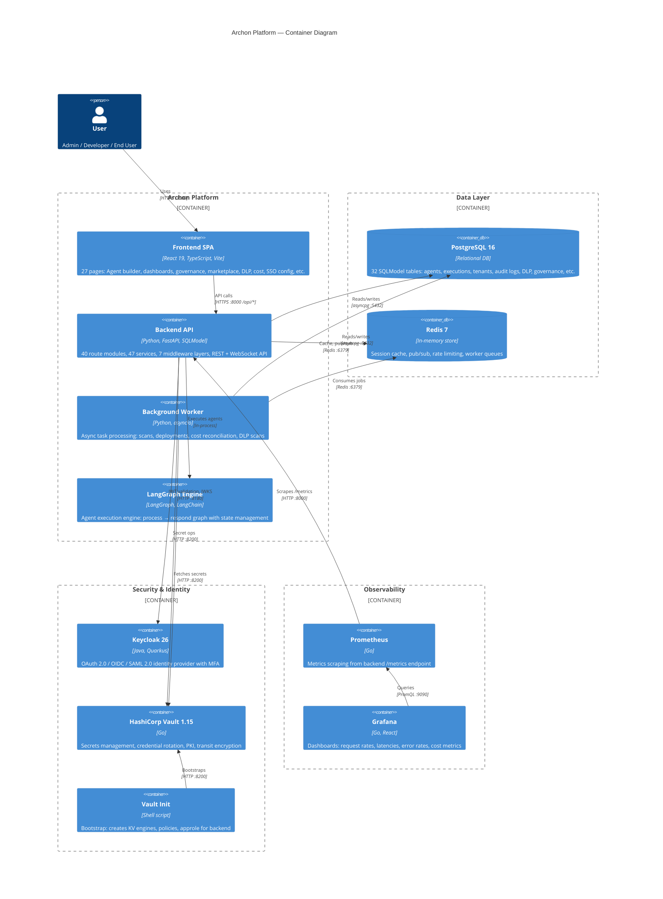
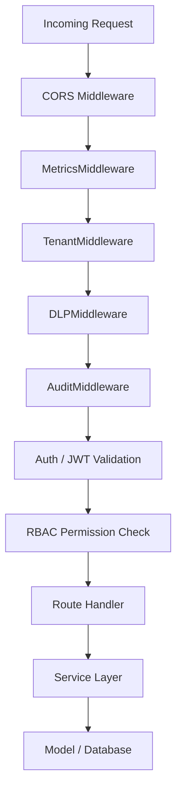

# C4 Container Diagram — Archon Platform

> Level 2 C4 diagram showing all containers (deployable units) within the Archon platform.

## Container Details

| Container | Technology | Port | Purpose |
|-----------|-----------|------|---------|
| **Frontend** | React 19, TypeScript, Vite | 3000 | 27-page SPA: agent builder, governance, DLP, cost, marketplace |
| **Backend API** | FastAPI, SQLModel, Python | 8000 | 40 route modules with 7 middleware layers (Auth → Tenant → RBAC → DLP → Audit → Metrics → CORS) |
| **Worker** | Python asyncio | — | Background tasks: SentinelScan, cost reconciliation, DLP scans, deployments |
| **LangGraph Engine** | LangGraph, LangChain | — | In-process agent execution: StateGraph with process → respond pipeline |
| **PostgreSQL** | PostgreSQL 16 | 5432 | 70+ SQLModel tables across 32 model files |
| **Redis** | Redis 7 | 6379 | Session cache, WebSocket pub/sub, rate limiting, task queues |
| **Keycloak** | Keycloak 26 | 8180 | OIDC/SAML provider, user federation, MFA, realm management |
| **Vault** | HashiCorp Vault 1.15 | 8200 | KV secrets, credential rotation, PKI, transit encryption |
| **Vault Init** | Shell script | — | One-shot bootstrap of Vault engines, policies, and approle |
| **Prometheus** | Prometheus | 9090 | Metrics scraping and alerting |
| **Grafana** | Grafana | 3001 | Observability dashboards |

## Middleware Stack (Request Processing Order)

