# C4 System Context — Archon Platform

> Level 1 C4 diagram showing Archon and all external actors/systems.

```mermaid
C4Context
    title Archon Platform — System Context Diagram

    Person(admin, "Platform Admin", "Manages tenants, policies, RBAC, SSO config")
    Person(developer, "AI Developer", "Builds, tests, deploys AI agents via UI or API")
    Person(enduser, "End User", "Invokes agents, views results, uses mobile SDK")
    Person(auditor, "Compliance Auditor", "Reviews audit logs, governance reports, DLP findings")

    Enterprise_Boundary(archon_boundary, "Archon Platform") {
        System(archon, "Archon", "Enterprise AI Agent Orchestration Platform\nFastAPI backend + React frontend + LangGraph engine + Worker")
    }

    System_Ext(keycloak, "Keycloak", "Identity Provider\nOAuth 2.0 / OIDC / SAML 2.0\nUser federation, MFA, SSO")
    System_Ext(vault, "HashiCorp Vault", "Secrets Management\nCredential storage, rotation, PKI, transit encryption")
    System_Ext(postgres, "PostgreSQL 16", "Primary data store\nAgent definitions, executions, audit logs, tenant data")
    System_Ext(redis, "Redis 7", "Cache & message broker\nSession cache, pub/sub, rate limiting, worker queues")
    System_Ext(prometheus, "Prometheus", "Metrics collection\nScrapes /metrics endpoint, alerting rules")
    System_Ext(grafana, "Grafana", "Observability dashboards\nVisualization of platform metrics and alerts")
    System_Ext(azure_openai, "Azure OpenAI / LLM Providers", "Language model inference\nGPT-4, Claude, etc. via model router")
    System_Ext(external_idp, "External IdP (SAML/OIDC)", "Customer identity providers\nFederated SSO for tenant users")
    System_Ext(scim_source, "SCIM Directory", "User/group provisioning\nAzure AD, Okta, etc.")
    System_Ext(connectors_ext, "External Services", "60+ connectors\nDatabases, REST APIs, S3, webhooks, OAuth providers")
    System_Ext(a2a_peers, "Federated Agent Peers", "A2A Protocol partners\nmTLS + OAuth federation")
    System_Ext(edge_devices, "Edge Devices", "IoT / edge runtimes\nOffline-capable agent execution")

    Rel(admin, archon, "Configures tenants, SSO, RBAC, policies", "HTTPS")
    Rel(developer, archon, "Builds agents, manages templates, deploys", "HTTPS / WebSocket")
    Rel(enduser, archon, "Invokes agents, views dashboards", "HTTPS / Mobile SDK")
    Rel(auditor, archon, "Reviews audit trails, compliance reports", "HTTPS")

    Rel(archon, keycloak, "Authenticates users, validates JWTs", "OIDC / SAML")
    Rel(archon, vault, "Stores/retrieves secrets, rotates credentials", "HTTP API")
    Rel(archon, postgres, "Reads/writes all persistent data", "asyncpg")
    Rel(archon, redis, "Caches sessions, publishes events", "Redis protocol")
    Rel(archon, azure_openai, "Routes LLM inference requests", "HTTPS")
    Rel(archon, connectors_ext, "Connects to external data sources", "Various protocols")
    Rel(archon, a2a_peers, "Federates agent communication", "A2A / mTLS")
    Rel(archon, edge_devices, "Deploys models, syncs state", "HTTPS / gRPC")

    Rel(external_idp, keycloak, "Federated SSO", "SAML / OIDC")
    Rel(scim_source, archon, "Provisions users/groups", "SCIM 2.0")
    Rel(prometheus, archon, "Scrapes metrics", "HTTP /metrics")
    Rel(grafana, prometheus, "Queries metrics", "PromQL")
```

## External System Details

| System | Protocol | Purpose |
|--------|----------|---------|
| Keycloak | OIDC / SAML 2.0 | Identity, SSO, MFA, user federation |
| HashiCorp Vault | HTTP REST | Secrets storage, rotation, PKI, transit |
| PostgreSQL 16 | asyncpg (TCP 5432) | All persistent data (agents, executions, audit, tenants) |
| Redis 7 | Redis protocol (TCP 6379) | Session cache, pub/sub events, worker queues |
| Prometheus | HTTP scrape (:8000/metrics) | Metrics collection and alerting |
| Grafana | PromQL queries | Dashboards and observability |
| Azure OpenAI / LLM | HTTPS REST | Model inference via intelligent router |
| External IdP | SAML / OIDC federation | Customer SSO providers (Okta, Azure AD, etc.) |
| SCIM Directory | SCIM 2.0 REST | Automated user/group provisioning |
| External Connectors | Various (REST, SQL, S3, etc.) | 60+ data source integrations |
| A2A Peers | mTLS + OAuth | Agent-to-Agent federation protocol |
| Edge Devices | HTTPS / gRPC | Offline-capable edge agent runtimes |
