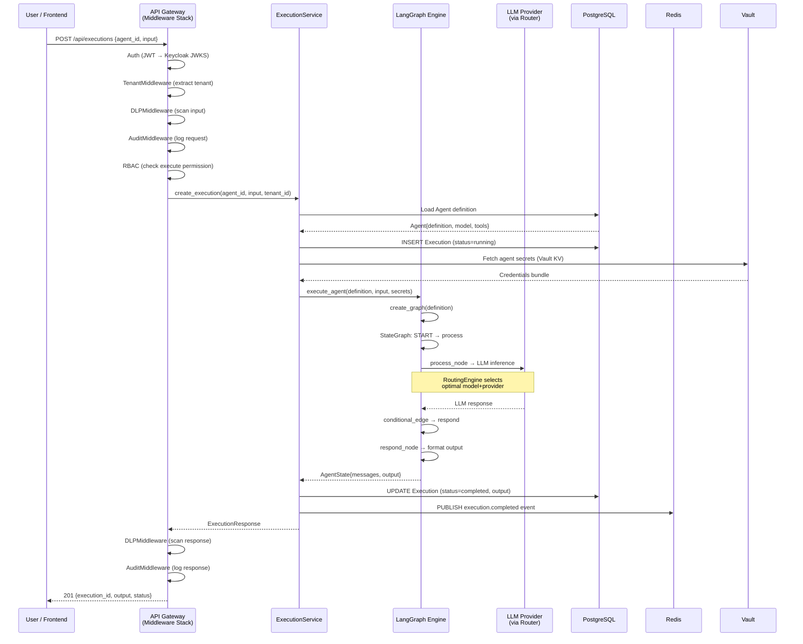
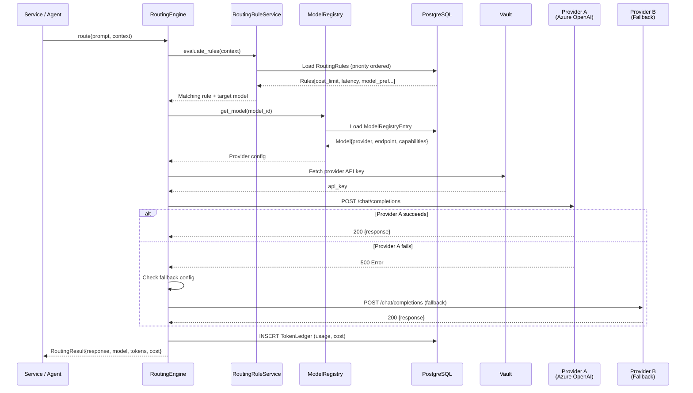
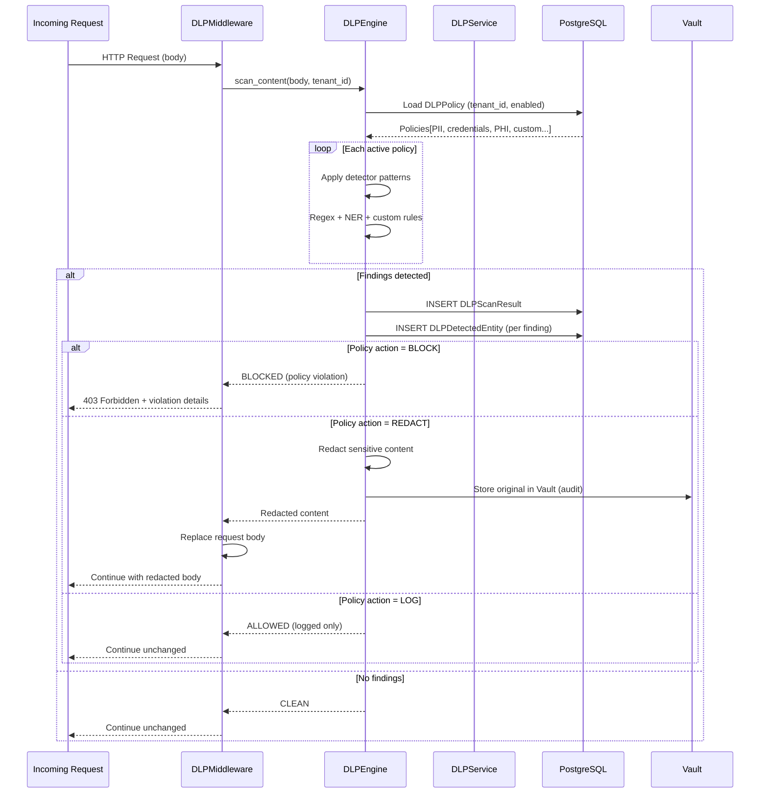
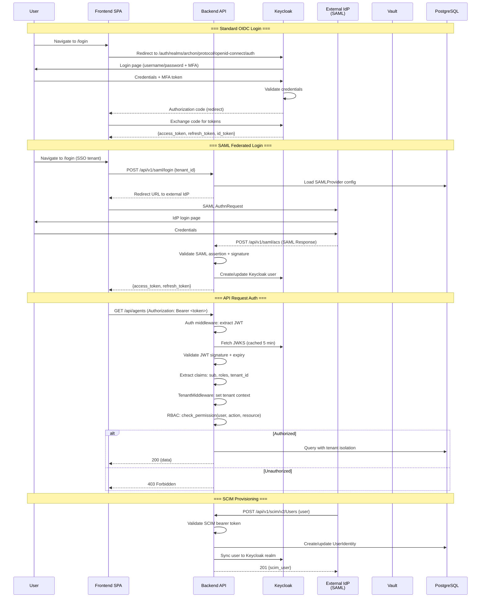
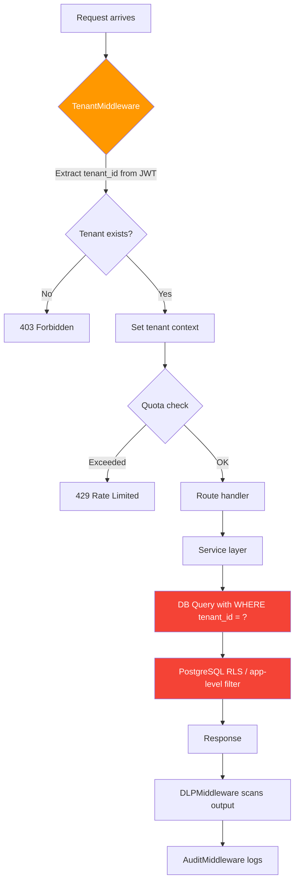
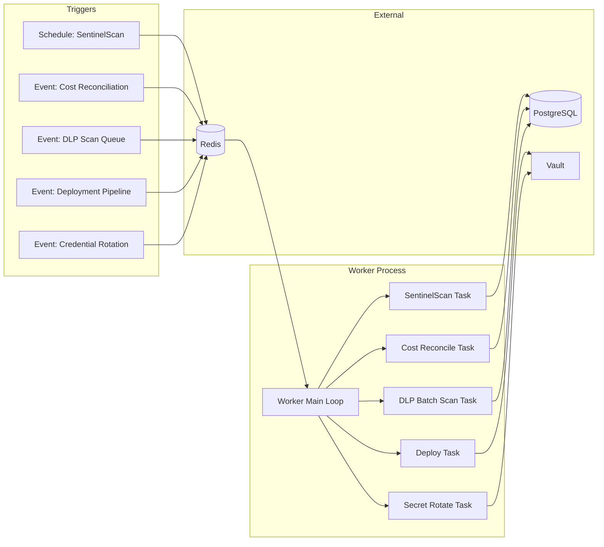

# Data Flow Diagrams — Archon Platform

> Sequence and flow diagrams for major subsystems.

---

## 1. Agent Execution Flow

## 2. Model Routing Flow

## 3. DLP (Data Loss Prevention) Flow

## 4. Authentication & Authorization Flow

## 5. Tenant Isolation Flow

## 6. Worker Background Processing

