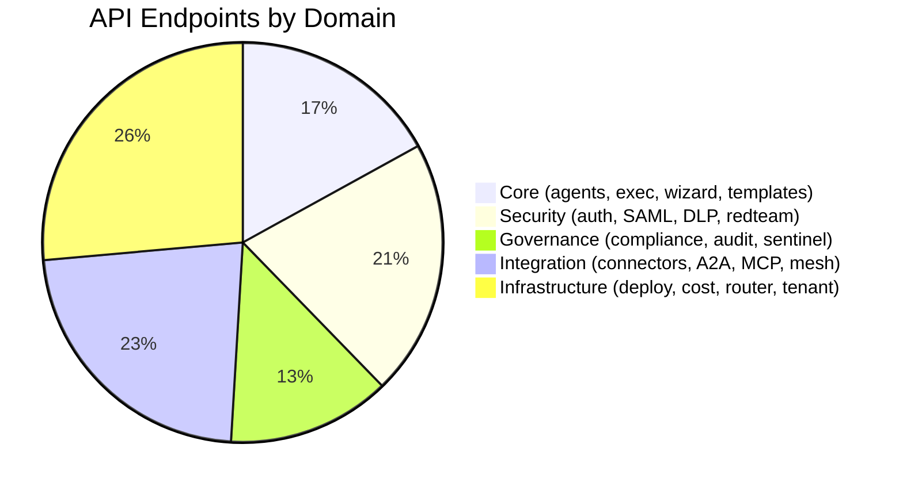

# Frontend → API Mapping — Archon Platform

> Maps each React frontend page to its backend API routes.

## Page → API Route Mapping

```mermaid
graph LR
    subgraph "Frontend Pages (React 19)"
        P_LOGIN["LoginPage"]
        P_MFA["MFAChallengePage"]
        P_DASH["DashboardPage"]
        P_AGENTS["AgentsPage"]
        P_BUILDER["BuilderPage"]
        P_EXEC["ExecutionsPage"]
        P_EXEC_D["ExecutionDetailPage"]
        P_MODELS["ModelRouterPage"]
        P_TEMPLATES["TemplatesPage"]
        P_CONN["ConnectorsPage"]
        P_WORK["WorkflowsPage"]
        P_DLP["DLPPage"]
        P_GUARD["GuardrailsPage"]
        P_GOV["GovernancePage"]
        P_AUDIT["AuditPage"]
        P_SENTINEL["SentinelScanPage"]
        P_REDTEAM["RedTeamPage"]
        P_COST["CostPage"]
        P_LIFE["LifecyclePage"]
        P_MKT["MarketplacePage"]
        P_MCP["MCPAppsPage"]
        P_SECRETS["SecretsPage"]
        P_SSO["SSOConfigPage"]
        P_TENANTS["TenantsPage"]
        P_SETTINGS["SettingsPage"]
        P_DOCFORGE["DocForgePage"]
    end

    subgraph "Backend API Routes"
        A_AUTH["/api/v1/auth\n/api/v1/saml\n/api/v1/sso"]
        A_AGENTS["/api/agents\n/api/agent-versions"]
        A_EXEC["/api/executions"]
        A_ROUTER["/api/router"]
        A_TEMPLATES["/api/templates"]
        A_CONN["/api/connectors"]
        A_WORK["/api/workflows"]
        A_DLP["/api/dlp\n/api/v1/dlp"]
        A_GOV["/api/governance"]
        A_AUDIT["/api/audit/logs"]
        A_SENTINEL["/api/sentinelscan"]
        A_REDTEAM["/api/v1/redteam"]
        A_COST["/api/cost\n/api/v1/cost"]
        A_LIFE["/api/lifecycle"]
        A_MKT["/api/marketplace"]
        A_MCP["/api/mcp\n/api/mcp-security"]
        A_SECRETS["/api/v1/secrets"]
        A_SSO["/api/v1/sso\n/api/v1 (SSO & RBAC)"]
        A_TENANTS["/api/tenants\n/api/v1/tenancy"]
        A_SETTINGS["/api/settings"]
        A_DOCFORGE["/api/docforge"]
        A_HEALTH["/api/v1/health"]
        A_WIZARD["/api/wizard"]
    end

    P_LOGIN --> A_AUTH
    P_MFA --> A_AUTH
    P_DASH --> A_HEALTH
    P_DASH --> A_EXEC
    P_DASH --> A_COST
    P_AGENTS --> A_AGENTS
    P_BUILDER --> A_AGENTS
    P_BUILDER --> A_WIZARD
    P_EXEC --> A_EXEC
    P_EXEC_D --> A_EXEC
    P_MODELS --> A_ROUTER
    P_TEMPLATES --> A_TEMPLATES
    P_CONN --> A_CONN
    P_WORK --> A_WORK
    P_DLP --> A_DLP
    P_GUARD --> A_DLP
    P_GOV --> A_GOV
    P_AUDIT --> A_AUDIT
    P_SENTINEL --> A_SENTINEL
    P_REDTEAM --> A_REDTEAM
    P_COST --> A_COST
    P_LIFE --> A_LIFE
    P_MKT --> A_MKT
    P_MCP --> A_MCP
    P_SECRETS --> A_SECRETS
    P_SSO --> A_SSO
    P_TENANTS --> A_TENANTS
    P_SETTINGS --> A_SETTINGS
    P_DOCFORGE --> A_DOCFORGE
```

## Detailed Mapping Table

| Frontend Page | File | Backend API Routes | Key Operations |
|--------------|------|-------------------|----------------|
| **LoginPage** | `LoginPage.tsx` | `/api/v1/auth/*`, `/api/v1/saml/login`, `/api/v1/sso/*` | OAuth login, SAML redirect, token exchange |
| **MFAChallengePage** | `MFAChallengePage.tsx` | `/api/v1/auth/mfa/verify` | TOTP/WebAuthn MFA challenge |
| **DashboardPage** | `DashboardPage.tsx` | `/api/v1/health`, `/api/executions`, `/api/cost/summary` | Platform health, recent executions, cost overview |
| **AgentsPage** | `AgentsPage.tsx` | `/api/agents` (GET, POST, PUT, DELETE) | CRUD agents, list/filter |
| **BuilderPage** | `BuilderPage.tsx` | `/api/agents`, `/api/wizard/*` | Visual agent builder, NL wizard, React Flow canvas |
| **ExecutionsPage** | `ExecutionsPage.tsx` | `/api/executions` (GET) | List executions, filter by status/agent |
| **ExecutionDetailPage** | `ExecutionDetailPage.tsx` | `/api/executions/{id}`, `/api/executions/{id}/replay` | View execution detail, replay, cancel |
| **ModelRouterPage** | `ModelRouterPage.tsx` | `/api/router/rules`, `/api/router/models`, `/api/router/providers` | Routing rules, model registry, provider management |
| **TemplatesPage** | `TemplatesPage.tsx` | `/api/templates` (GET, POST) | Browse/create agent templates |
| **ConnectorsPage** | `ConnectorsPage.tsx` | `/api/connectors` (CRUD), `/api/v1/connectors/oauth/*/authorize` | Manage connectors, OAuth flows |
| **WorkflowsPage** | `WorkflowsPage.tsx` | `/api/workflows` (CRUD) | Multi-step workflow management |
| **DLPPage** | `DLPPage.tsx` | `/api/v1/dlp/policies`, `/api/v1/dlp/detectors` | DLP policy management, detector config |
| **GuardrailsPage** | `GuardrailsPage.tsx` | `/api/dlp/*` | Guardrail policies, scan results |
| **GovernancePage** | `GovernancePage.tsx` | `/api/governance/policies`, `/api/governance/approvals`, `/api/governance/registry` | Compliance policies, approval workflows, agent registry |
| **AuditPage** | `AuditPage.tsx` | `/api/audit/logs` (GET), `/api/audit/logs/export` | View/export audit trail |
| **SentinelScanPage** | `SentinelScanPage.tsx` | `/api/sentinelscan/discovery`, `/api/sentinelscan/inventory`, `/api/sentinelscan/risk` | Shadow AI discovery, risk classification |
| **RedTeamPage** | `RedTeamPage.tsx` | `/api/v1/redteam/scans` | Security scans, vulnerability reports |
| **CostPage** | `CostPage.tsx` | `/api/v1/cost/summary`, `/api/v1/cost/chart`, `/api/v1/cost/budgets`, `/api/v1/cost/export` | Cost analytics, budgets, forecasting |
| **LifecyclePage** | `LifecyclePage.tsx` | `/api/lifecycle/*` | Deployment lifecycle, health checks, rollback |
| **MarketplacePage** | `MarketplacePage.tsx` | `/api/marketplace/*` | Browse, install, review marketplace listings |
| **MCPAppsPage** | `MCPAppsPage.tsx` | `/api/mcp/*`, `/api/mcp-security/*` | MCP component management, security config |
| **SecretsPage** | `SecretsPage.tsx` | `/api/v1/secrets/*` | Secret registration, access logs |
| **SSOConfigPage** | `SSOConfigPage.tsx` | `/api/v1/tenants/*/sso`, `/api/v1/rbac/*` | SSO provider config, RBAC roles |
| **TenantsPage** | `TenantsPage.tsx` | `/api/tenants/*`, `/api/v1/tenancy/*` | Tenant CRUD, IdP config, quotas |
| **SettingsPage** | `SettingsPage.tsx` | `/api/settings/*` | Platform settings, feature flags, API keys |
| **DocForgePage** | `DocForgePage.tsx` | `/api/docforge/*` | Document ingestion, search, collections |

### Admin Pages (nested under `/admin`)

| Page | File | Backend API |
|------|------|-------------|
| **AuditLogPage** | `admin/AuditLogPage.tsx` | `/api/audit/logs` |
| **SecretsPage** | `admin/SecretsPage.tsx` | `/api/v1/secrets/*` |
| **UsersPage** | `admin/UsersPage.tsx` | `/api/v1/scim/v2/Users`, `/api/v1 (SSO & RBAC)` |

## API Endpoint Count by Domain

