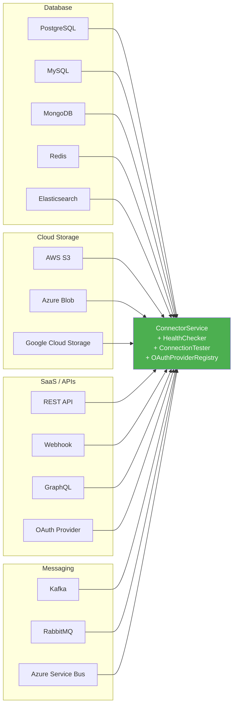

# Integration Map — Archon Platform

> All external service connections, protocols, and integration points.

## System Integration Overview

```mermaid
graph TB
    subgraph "Archon Platform"
        BE["Backend API\n:8000"]
        FE["Frontend SPA\n:3000"]
        WK["Worker"]
    end

    subgraph "Identity & Access"
        KC["Keycloak 26\n:8180\nOIDC / SAML 2.0"]
        EXT_IDP["External IdPs\n(Okta, Azure AD, PingFederate)"]
        SCIM_DIR["SCIM Directories\n(Azure AD, Okta)"]
    end

    subgraph "Secrets & Crypto"
        VAULT["HashiCorp Vault 1.15\n:8200\nKV v2, Transit, PKI"]
    end

    subgraph "Data Stores"
        PG["PostgreSQL 16\n:5432\n70+ tables"]
        REDIS["Redis 7\n:6379\nCache + Pub/Sub"]
    end

    subgraph "Observability"
        PROM["Prometheus\n:9090"]
        GRAF["Grafana\n:3001"]
    end

    subgraph "LLM Providers"
        AZ_OAI["Azure OpenAI"]
        OPENAI["OpenAI API"]
        ANTHROPIC["Anthropic / Claude"]
        CUSTOM_LLM["Custom LLM\nEndpoints"]
    end

    subgraph "Connectors (60+)"
        DB_CONN["Database Connectors\n(PostgreSQL, MySQL, MongoDB, Redis)"]
        CLOUD_CONN["Cloud Storage\n(S3, Azure Blob, GCS)"]
        API_CONN["REST API Connectors\n(Webhook, OAuth)"]
        SAAS_CONN["SaaS Integrations"]
    end

    subgraph "Federation"
        A2A_PEERS["A2A Protocol Peers\n(mTLS + OAuth)"]
        MESH_NODES["Federated Mesh Nodes\n(Cross-org agents)"]
    end

    subgraph "Edge"
        EDGE_DEV["Edge Devices\n(IoT / On-prem runtimes)"]
    end

    subgraph "Infrastructure"
        K8S["Kubernetes Cluster"]
        HELM["Helm Charts"]
        TF["Terraform\n(AWS/Azure/GCP)"]
        ARGO["ArgoCD\nGitOps"]
    end

    %% Identity flows
    BE -->|"OIDC JWT validation\n(JWKS fetch, cached 5m)"| KC
    BE -->|"SAML assertion\nvalidation"| KC
    KC <-->|"SAML / OIDC\nFederation"| EXT_IDP
    BE -->|"SCIM 2.0\nUser/Group sync"| SCIM_DIR

    %% Secrets
    BE -->|"HTTP API\nKV read/write, transit encrypt"| VAULT
    WK -->|"HTTP API\nCredential rotation"| VAULT

    %% Data
    BE -->|"asyncpg\nConnection pool"| PG
    BE -->|"aioredis\nSession + pub/sub"| REDIS
    WK -->|"asyncpg"| PG
    WK -->|"aioredis\nJob queue consume"| REDIS

    %% Observability
    PROM -->|"HTTP scrape\n/metrics"| BE
    GRAF -->|"PromQL"| PROM

    %% LLM
    BE -->|"HTTPS REST\n(via RoutingEngine)"| AZ_OAI
    BE -->|"HTTPS REST"| OPENAI
    BE -->|"HTTPS REST"| ANTHROPIC
    BE -->|"HTTPS REST"| CUSTOM_LLM

    %% Connectors
    BE -->|"Various protocols"| DB_CONN
    BE -->|"S3 / Azure / GCS API"| CLOUD_CONN
    BE -->|"HTTP / OAuth 2.0"| API_CONN
    BE -->|"REST API"| SAAS_CONN

    %% Federation
    BE -->|"A2A Protocol\nmTLS + OAuth"| A2A_PEERS
    BE -->|"Mesh Protocol\nFederated identity"| MESH_NODES

    %% Edge
    BE -->|"HTTPS / gRPC\nModel sync, OTA"| EDGE_DEV

    %% Frontend
    FE -->|"HTTPS REST\n+ WebSocket"| BE

    %% Infrastructure
    BE -.->|"Deployed via"| K8S
    K8S -.-> HELM
    K8S -.-> TF
    K8S -.-> ARGO

    style BE fill:#2196f3,color:#fff
    style FE fill:#4caf50,color:#fff
    style WK fill:#ff9800,color:#fff
```

## Integration Detail Table

| Integration | Protocol | Port | Auth Method | Direction | Service |
|-------------|----------|------|-------------|-----------|---------|
| **Keycloak** | OIDC / SAML 2.0 | 8180 | Client credentials + JWKS | Backend → Keycloak | Auth middleware |
| **Vault** | HTTP REST API | 8200 | AppRole token | Backend/Worker → Vault | All services needing secrets |
| **PostgreSQL** | asyncpg (TCP) | 5432 | Username/password | Backend/Worker → PG | All services |
| **Redis** | Redis protocol | 6379 | None (dev) / AUTH (prod) | Backend/Worker → Redis | Session, cache, pub/sub |
| **Prometheus** | HTTP scrape | 9090→8000 | None | Prometheus → Backend | MetricsMiddleware |
| **Grafana** | PromQL | 3001→9090 | Admin auth | Grafana → Prometheus | — |
| **Azure OpenAI** | HTTPS REST | 443 | API Key (from Vault) | Backend → Azure | RoutingEngine |
| **OpenAI** | HTTPS REST | 443 | API Key (from Vault) | Backend → OpenAI | RoutingEngine |
| **Anthropic** | HTTPS REST | 443 | API Key (from Vault) | Backend → Anthropic | RoutingEngine |
| **External IdPs** | SAML 2.0 / OIDC | 443 | Federation trust | Keycloak ↔ IdP | SAMLService |
| **SCIM Directory** | SCIM 2.0 REST | 443 | Bearer token | Directory → Backend | SCIMService |
| **Database Connectors** | Native protocols | Various | Credentials from Vault | Backend → Databases | ConnectorService |
| **Cloud Storage** | S3/Azure/GCS API | 443 | IAM / Keys from Vault | Backend → Cloud | ConnectorService |
| **REST Connectors** | HTTP/HTTPS | 443 | OAuth 2.0 / API Key | Backend → Services | ConnectorService, OAuthProviderRegistry |
| **A2A Peers** | mTLS + OAuth 2.0 | 443 | mTLS certificates + OAuth tokens | Backend ↔ Peers | A2AService, A2AClient |
| **Mesh Nodes** | HTTPS | 443 | Federated identity tokens | Backend ↔ Nodes | MeshService |
| **Edge Devices** | HTTPS / gRPC | Various | Device tokens (offline-capable) | Backend ↔ Devices | EdgeService |
| **Frontend** | HTTPS + WebSocket | 3000→8000 | JWT Bearer | Frontend → Backend | All routes |

## Vault Secret Paths

| Path | Purpose | Consumers |
|------|---------|-----------|
| `secret/archon/providers/*` | LLM provider API keys | RoutingEngine |
| `secret/archon/connectors/*` | Connector credentials | ConnectorService |
| `secret/archon/tenants/*/secrets` | Per-tenant secrets | TenantService |
| `secret/archon/saml/*` | SAML signing keys | SAMLService |
| `secret/archon/edge/*/tokens` | Edge device tokens | EdgeService |
| `secret/archon/a2a/partners/*` | A2A federation credentials | A2AService |
| `transit/archon` | Transit encryption for DocForge | DocForgeService |
| `pki/archon` | TLS certificates for mTLS | DeploymentService |

## Connector Types (60+)

