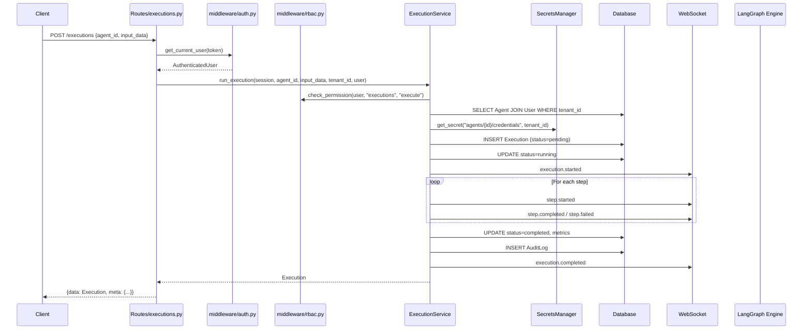

# 01 — Agent Execution Flow

## Overview
End-to-end flow from HTTP request to agent execution with per-step tracing, WebSocket streaming, and audit logging.

## Trigger
| Method | Path | Handler |
|--------|------|---------|
| `POST` | `/executions` | `routes/executions.py::create_and_run_execution` |
| `POST` | `/agents/{agent_id}/execute` | `routes/agents.py::execute_agent` |
| `POST` | `/execute` | `routes/executions.py::create_execution` |

## Steps

### 1. Request Validation & Auth
- `get_current_user` dependency extracts `AuthenticatedUser` from JWT (Bearer or cookie)
- `ExecutionRunRequest` validated: `agent_id: UUID`, `input_data: dict`, `config_overrides: dict | None`
- `tenant_id` resolved from `user.tenant_id`

### 2. ExecutionService.run_execution (enterprise path)
**File:** `services/execution_service.py` — `ExecutionService.run_execution()`

1. **RBAC check** — `check_permission(user, "executions", "execute")`
2. **Tenant-scoped agent lookup** — joins `Agent → User` where `User.tenant_id == tenant_id`
3. **Credential injection** — `SecretsManager.get_secret(f"agents/{agent_id}/credentials", tenant_id)`
4. **Execution record created** — `Execution(id=uuid4(), status="pending", ...)`
5. **Audit: `execution.created`** — `_audit(session, user, "execution.created", execution.id)`
6. **Status transition** — `pending → running`, `started_at` set
7. **WS callback** — `ws_callback("execution.started", {...})` if provided

### 3. Step Simulation
**File:** `services/execution_service.py` — `_generate_mock_steps()`

7 steps generated: `parse_input → retrieve_context → llm_reasoning → tool_execution → condition_check → generate_response → format_output`

For each step:
- WS event: `step.started`
- If `tool_call`: WS event `tool.called`
- If `llm_call`: WS event `llm.response`
- WS event: `step.completed` with `duration_ms`, `tokens`, `cost`
- On failure: `step.failed` → break loop

### 4. Metrics & Completion
- `total_duration_ms`, `total_tokens`, `total_cost` aggregated
- Status set to `completed` or `failed`
- `output_data` populated on success; `error` field on failure
- Audit: `execution.completed` or `execution.failed`
- Final WS event broadcast

### 5. LangGraph Engine (parallel path)
**File:** `langgraph/engine.py` — `execute_agent()`

1. Credential injection via `_inject_credentials(definition, tenant_id)`
2. `create_graph(definition)` builds `StateGraph(AgentState)`
3. Graph: `START → process → (conditional) → respond → END`
4. `process_node(state)` — echoes input as `AIMessage("Processed: {content}")`
5. `_should_respond(state)` — routes to `respond` or `END` on error
6. `respond_node(state)` — packages AI messages into `output` field
7. Returns `{"output": ..., "steps": [...], "status": "completed"}`

## Services Involved
| Service | Class/Function | File |
|---------|---------------|------|
| Agent CRUD | `agent_service.get_agent()` | `services/agent_service.py` |
| Execution | `ExecutionService` | `services/execution_service.py` |
| LangGraph | `execute_agent()`, `LangGraphEngine` | `langgraph/engine.py` |
| Nodes | `process_node()`, `respond_node()` | `langgraph/nodes.py` |
| RBAC | `check_permission()` | `middleware/rbac.py` |
| Secrets | `SecretsManager.get_secret()` | `secrets/manager.py` |
| Audit | `_audit()` | `services/execution_service.py` |

## Data Transformations

```
Input:  ExecutionRunRequest { agent_id, input_data, config_overrides }
  ↓
State:  AgentState { messages: [HumanMessage], current_step, output, error }
  ↓
Steps:  [{ step_name, step_type, status, duration_ms, token_usage, cost, input, output, error }]
  ↓
Output: Execution { id, agent_id, status, input_data, output_data, steps, metrics, ... }
```

## Error Paths
| Error | Handler | HTTP Code |
|-------|---------|-----------|
| Agent not found in tenant | `ValueError` → `HTTPException` | 404 |
| RBAC denied | `check_permission` returns False | 403 |
| Secrets fetch failure | `except Exception: cred_data = {}` | pass-through |
| Step failure (10% chance) | `execution.status = "failed"` | 201 (execution recorded) |
| LangGraph error | `except Exception` → `{"error": ..., "status": "failed"}` | 200 |

## Mermaid Sequence Diagram


