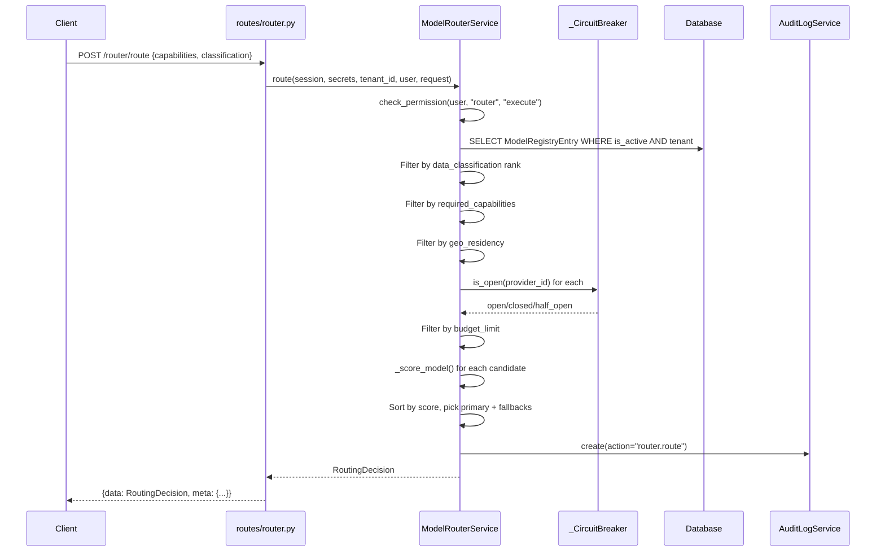

# 02 — Model Routing Flow

## Overview
Intelligent model selection engine that scores candidates by cost, latency, capability, and data classification with circuit breaker protection and fallback chains.

## Trigger
| Method | Path | Handler |
|--------|------|---------|
| `POST` | `/router/route` | `routes/router.py::route_request` |

## Steps

### 1. Route Request (Simple Path)
**File:** `routes/router.py` — `route_request()`

- Validates `RouteRequest`: `department_id`, `agent_id`, `required_capabilities`, `data_classification`, `strategy_override`
- Calls `RoutingEngine.route(session, ...)` from `services/router.py`

### 2. Enterprise Route (ModelRouterService)
**File:** `services/router_service.py` — `ModelRouterService.route()`

1. **RBAC** — `check_permission(user, "router", "execute")`
2. **Fetch candidates** — `_fetch_tenant_models(session, tenant_id)` — active models scoped to tenant
3. **Load routing policy** — `_load_routing_policy(session, tenant_id)` — per-tenant weights or defaults
4. **Filter: data classification** — `_CLASSIFICATION_RANK = {"general": 0, "internal": 1, "restricted": 2}` — model rank ≥ request rank
5. **Filter: capabilities** — `required.issubset(model.capabilities)`
6. **Filter: geo residency** — `model.config["geo_residency"] == request.geo_residency`
7. **Filter: circuit breaker** — `_circuit_breaker.is_open(str(model.id))` — skip open circuits
8. **Filter: budget limit** — `(model.cost_per_input_token * tokens/1000) <= budget_limit`
9. **Score candidates** — `_score_model(model, request, policy)` returns `(score, factors: list[DecisionFactor])`
10. **Sort by score** descending, select primary + fallbacks (top 3)
11. **Build RoutingDecision** — `selected_model`, `selected_provider`, `score`, `explanation`, `fallback_chain`, `decision_factors`, `decision_ms`
12. **Audit log** — `AuditLogService.create(action="router.route")`

### 3. Circuit Breaker
**File:** `services/router_service.py` — `_CircuitBreaker` class

- `FAILURE_THRESHOLD = 3`, `RESET_TIMEOUT_S = 60.0`
- States: `closed → open → half_open → closed`
- `record_failure()` — increments counter, opens after threshold
- `record_success()` — resets counter, closes circuit
- `is_open()` — checks state + timeout for half_open transition

## Services Involved
| Service | Class | File |
|---------|-------|------|
| Router (simple) | `RoutingEngine`, `ModelRegistry`, `RoutingRuleService` | `services/router.py` |
| Router (enterprise) | `ModelRouterService` | `services/router_service.py` |
| Circuit Breaker | `_CircuitBreaker` | `services/router_service.py` |
| Audit | `AuditLogService` | `services/audit_log_service.py` |
| RBAC | `check_permission()` | `middleware/rbac.py` |

## Data Transformations

```
Input:  RoutingRequest { task_type, required_capabilities, data_classification, geo_residency, budget_limit, input_tokens_estimate }
  ↓
Filter: [ModelRegistryEntry] → filtered by classification, capabilities, geo, circuit breaker, budget
  ↓
Score:  _score_model() → (score: float, factors: list[DecisionFactor])
  ↓
Output: RoutingDecision { selected_model, selected_provider, score, explanation, fallback_chain, decision_factors, decision_ms, data_classification_met }
```

## Error Paths
| Error | Result |
|-------|--------|
| No eligible models after filtering | `RoutingDecision(selected_model="none", score=0.0)` |
| RBAC denied | 403 Forbidden |
| Circuit breaker open | Model excluded from candidates |

## Mermaid Sequence Diagram


