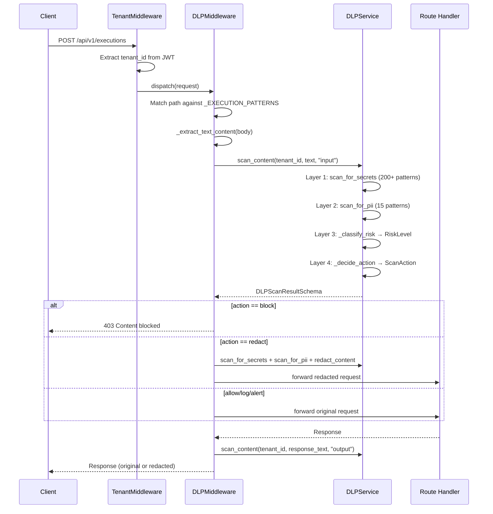

# 03 — DLP (Data Loss Prevention) Flow

## Overview
4-layer DLP pipeline that scans all execution I/O for secrets, PII, prompt injection, and policy violations. Operates as both middleware (automatic) and service (on-demand).

## Triggers
| Layer | Trigger | File |
|-------|---------|------|
| Middleware | Any `POST/PUT/PATCH` to `/api/v1/executions\|agents/.*/execute\|chat` | `middleware/dlp_middleware.py` |
| Service | Direct API call to DLP scan endpoints | `routes/dlp.py` |
| Engine | Programmatic `DLPEngine.scan_text()` | `services/dlp.py` |

## Middleware Flow (DLPMiddleware)
**File:** `middleware/dlp_middleware.py` — `DLPMiddleware.dispatch()`

### Path Matching
- Skip: `/(healthz|readyz|livez|docs|redoc|openapi.json|static)`
- Scan only: `POST`, `PUT`, `PATCH` methods
- Target: `/api/v1/(executions|agents/.*/execute|agents/.*/run|chat)`

### Input Scan (before handler)
1. Read `request.body()` 
2. `_extract_text_content(body)` — parses JSON, extracts from fields: `content`, `input`, `message`, `prompt`, `text`, `query`, `messages`
3. `_scan_text(text, tenant_id, "input")` → calls `DLPService.scan_content()`
4. `_apply_action(action, text, ...)` based on result

### Output Scan (after handler)
1. Read response body from `response.body_iterator`
2. Same extraction + scan pipeline with `direction="output"`
3. Re-create response with original or redacted body

### Actions
| Action | Behavior |
|--------|----------|
| `block` | Return `403 JSONResponse` with `"Content blocked by DLP policy"` |
| `redact` | Call `DLPService.scan_for_secrets()` + `scan_for_pii()` + `redact_content()` |
| `alert` | Log warning with `alert=True` flag |
| `log` | Log detection info |

## DLPService 4-Layer Pipeline
**File:** `services/dlp_service.py` — `DLPService.scan_content()`

### Layer 1: Secret Scanning (`scan_for_secrets`)
200+ regex patterns covering:
- AWS (access key, secret key, session token, MWS, ARN)
- Azure (client secret, storage key, SAS token, connection string, DevOps PAT, Cosmos key)
- GCP (API key, service account, OAuth token, Firebase)
- GitHub (PAT fine-grained, classic, OAuth, app token)
- Database URIs (Postgres, MySQL, MongoDB, Redis, MSSQL, Elasticsearch, AMQP)
- JWTs, Bearer tokens, Basic auth
- Private keys (RSA, OpenSSH, EC, PGP, DSA, PKCS8)
- 50+ vendor-specific (Stripe, Twilio, SendGrid, Slack, etc.)

### Layer 2: PII Scanning (`scan_for_pii`)
15 PII patterns: email, phone_us, phone_intl, ssn, credit_card (Visa/MC/Amex/Discover), ip_address, date_of_birth, us_passport, drivers_license, iban, nhs_number, medicare_number

### Layer 3: Risk Classification (`_classify_risk`)
Scores based on findings count × severity → `RiskLevel.LOW | MEDIUM | HIGH | CRITICAL`

### Layer 4: Policy Decision (`_decide_action`)
Maps `(risk_level, direction)` → `ScanAction.ALLOW | REDACT | BLOCK`

## DLPEngine (DB-backed)
**File:** `services/dlp.py` — `DLPEngine`

- `scan_text()` — built-in + custom patterns, min_confidence filter, overlap dedup
- `redact_text()` — scan + replace matched spans with templates (`***-**-****`, `[EMAIL REDACTED]`, etc.)
- `scan_and_record()` — scan + persist `DLPScanResult` + `DLPDetectedEntity` to DB (text never stored, only SHA-256 hash)

## Models
**File:** `models/dlp.py`

| Model | Key Fields |
|-------|------------|
| `DLPPolicy` | `tenant_id`, `name`, `detector_types: list[str]`, `custom_patterns: dict[str,str]`, `rules`, `action`, `sensitivity`, `agent_id`, `department_id` |
| `DLPScanResult` | `policy_id`, `source`, `text_hash`, `has_findings`, `findings_count`, `action_taken`, `entity_types_found` |
| `DLPDetectedEntity` | `scan_result_id`, `entity_type`, `confidence`, `start_offset`, `end_offset`, `redacted_value` |

## Mermaid Sequence Diagram

