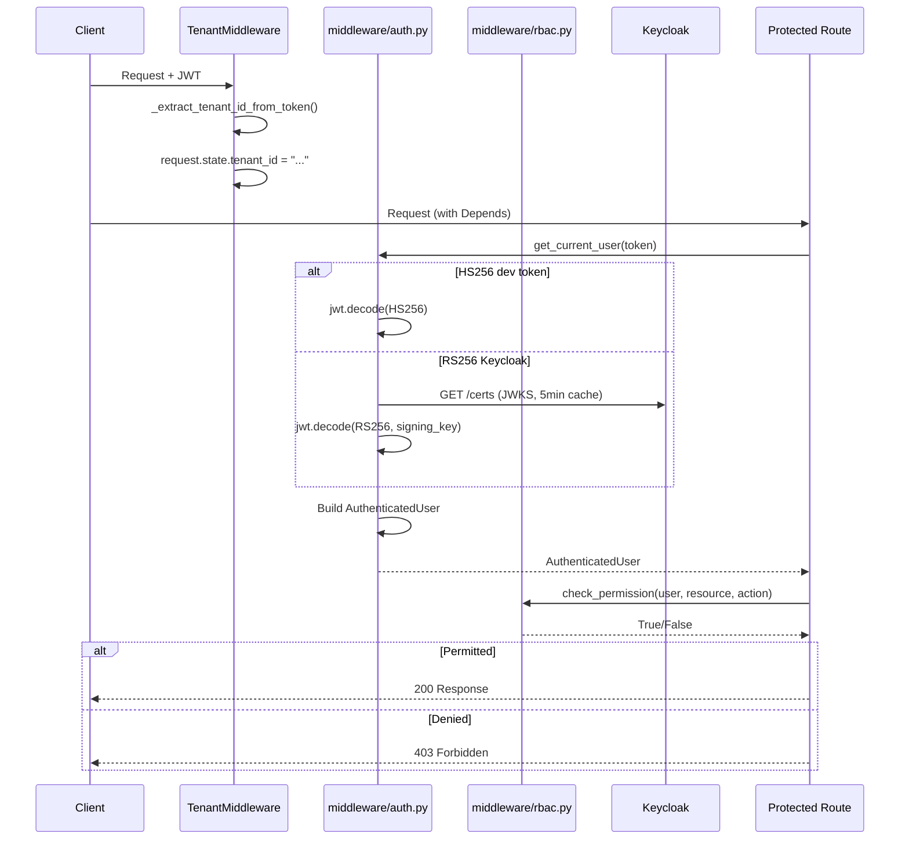

# 04 — Auth & Authorization Flow

## Overview
Multi-path authentication supporting dev-mode HS256, Keycloak OIDC RS256, SAML SSO, and TOTP MFA, layered with RBAC and tenant isolation middleware.

## Triggers
| Method | Path | Handler |
|--------|------|---------|
| `POST` | `/api/v1/auth/login` | `auth_routes.py::dev_login` |
| `POST` | `/api/v1/auth/token` | `auth_routes.py::login` |
| `POST` | `/api/v1/auth/token/refresh` | `auth_routes.py::refresh_token` |
| `GET`  | `/api/v1/auth/me` | `auth_routes.py::get_me` |
| `POST` | `/api/v1/auth/saml/acs` | `auth_routes.py::saml_acs` |
| `POST` | `/api/v1/auth/mfa/totp/setup` | `auth_routes.py::mfa_totp_setup` |
| `POST` | `/api/v1/auth/mfa/totp/verify` | `auth_routes.py::mfa_totp_verify` |
| `POST` | `/api/v1/auth/logout` | `auth_routes.py::logout` |

## Authentication Paths

### Path 1: Dev-Mode Login (HS256)
**Condition:** `settings.AUTH_DEV_MODE == True`

1. Lookup email in `_DEV_USERS` dict (admin@archon.local, user@archon.local)
2. `_dev_create_token(user_info, email)` — mints HS256 JWT with `jose_jwt.encode()` using `settings.JWT_SECRET`
3. JWT payload: `sub`, `email`, `name`, `tenant_id`, `roles`, `permissions`, `realm_access`, `mfa_verified`, `sid`, `iat`, `exp`
4. Set `access_token` cookie (httponly, samesite=lax, 8h TTL)

### Path 2: Keycloak OIDC (RS256)
**Condition:** `settings.AUTH_DEV_MODE == False`

1. `_keycloak_token_grant(email, pwd)` — POST to `{KEYCLOAK_URL}/protocol/openid-connect/token` with `grant_type=password`
2. Returns `access_token`, `refresh_token`, `expires_in`
3. Token set as httponly cookie

### Path 3: SAML SSO
1. `GET /saml/metadata` — returns SP entity_id (`urn:archon:sp`), ACS URL, nameId format
2. `POST /saml/acs` — receives `SAMLACSPayload(saml_response, relay_state)`, validates assertion, issues JWT

## Token Validation (middleware/auth.py)
**File:** `middleware/auth.py` — `get_current_user()`

1. Extract token from `Authorization: Bearer ...` or `access_token` cookie
2. If no token + `AUTH_DEV_MODE`: return synthetic admin user
3. **Try HS256** — `jwt.decode(token, settings.JWT_SECRET, algorithms=["HS256"])`
4. **Fallback RS256** — `_fetch_jwks()` from `{KEYCLOAK_URL}/protocol/openid-connect/certs` (5min TTL cache)
5. `_get_signing_key(jwks, token)` — match `kid` header to JWKS key
6. `jwt.decode(token, signing_key, algorithms=[JWT_ALGORITHM], audience="account", issuer=KEYCLOAK_URL)`
7. Extract: `sub`, `email`, `tenant_id` (claim or issuer fallback), `roles` (via `_extract_roles`), `permissions`, `mfa_verified`, `session_id`
8. Return `AuthenticatedUser(id, email, tenant_id, roles, permissions, mfa_verified, session_id)`

## RBAC (middleware/rbac.py)
**File:** `middleware/rbac.py`

### Role → Action Mappings
| Role | Actions | Resource Scope |
|------|---------|---------------|
| `admin` | create, read, update, delete, execute, admin | All resources |
| `operator` | read, execute | All resources |
| `viewer` | read | All resources |
| `agent_creator` | create, read | `agents` only |

### `check_permission(user, resource, action)`
1. Check explicit permissions: `"resource:action" in user.permissions`
2. Check role-based: iterate `user.roles`, match action in `_ROLE_ACTIONS[role]`, verify resource in `_ROLE_RESOURCES[role]`

### `require_permission(resource, action)` — FastAPI Depends wrapper

## Tenant Middleware
**File:** `middleware/tenant_middleware.py` — `TenantMiddleware`

1. Skip health/docs/metrics paths
2. Extract JWT from Authorization header or cookie
3. `_extract_tenant_id_from_token(token)` — unverified decode, reads `tenant_id` claim or falls back to Keycloak issuer path segment
4. Sets `request.state.tenant_id` (defaults to `"default"`)

## Mermaid Sequence Diagram

