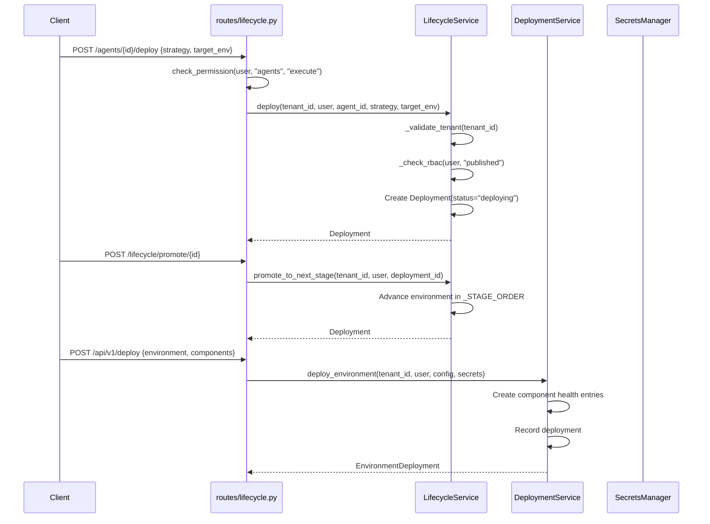

# 05 — Lifecycle & Deployment Flow

## Overview
Agent lifecycle state machine (Draft→Archived) with canary/blue-green/rolling/shadow deployment strategies, pipeline promotion, approval gates, health scoring, anomaly detection, and infrastructure management.

## Triggers

### Lifecycle
| Method | Path | Handler |
|--------|------|---------|
| `POST` | `/agents/{id}/lifecycle/transition` | `lifecycle.py::enterprise_transition` |
| `POST` | `/agents/{id}/deploy` | `lifecycle.py::enterprise_deploy` |
| `POST` | `/deployments/{id}/rollback` | `lifecycle.py::enterprise_rollback` |
| `GET`  | `/agents/{id}/health` | `lifecycle.py::enterprise_health` |
| `GET`  | `/agents/{id}/anomalies` | `lifecycle.py::enterprise_anomalies` |
| `POST` | `/agents/{id}/schedule` | `lifecycle.py::enterprise_schedule` |

### Pipeline
| Method | Path | Handler |
|--------|------|---------|
| `POST` | `/lifecycle/deploy` | `lifecycle.py::enhanced_deploy` |
| `POST` | `/lifecycle/promote/{id}` | `lifecycle.py::promote_deployment` |
| `POST` | `/lifecycle/demote/{id}` | `lifecycle.py::demote_deployment` |
| `POST` | `/lifecycle/rollback/{id}` | `lifecycle.py::rollback_v1` |
| `GET`  | `/lifecycle/pipeline` | `lifecycle.py::get_pipeline` |

### Infrastructure
| Method | Path | Handler |
|--------|------|---------|
| `POST` | `/api/v1/deploy` | `deployment.py::deploy_environment` |
| `POST` | `/api/v1/deploy/{id}/rollback` | `deployment.py::rollback_deployment` |
| `POST` | `/api/v1/deploy/scale` | `deployment.py::scale_component` |
| `GET`  | `/api/v1/deploy/health` | `deployment.py::infrastructure_health` |

## State Machine
**File:** `services/lifecycle_service.py` — `LifecycleService.transition()`

```
Draft → Review → Approved → Published → Deprecated → Archived
```

**Transition roles:** `_TRANSITION_ROLES`
| Target State | Required Roles |
|-------------|---------------|
| `review` | admin, operator, agent_creator |
| `approved` | admin |
| `published` | admin, operator |
| `deprecated` | admin, operator |
| `archived` | admin |

## Deployment Strategies
**File:** `services/lifecycle_service.py` — `LifecycleService.deploy()`

`DeploymentStrategyType`: `ROLLING | BLUE_GREEN | CANARY | SHADOW`

- `DeploymentStrategy(type, canary_percentage, rollback_threshold)`
- Shadow deployments get status `"shadow"`

## Pipeline Stages
`_STAGE_ORDER = ["dev", "staging", "canary", "production"]`

- `promote_to_next_stage()` — moves deployment to next stage index
- `demote_to_previous_stage()` — moves to previous stage
- Approval gates configurable per stage via `configure_gates()`

## Health & Anomalies
- `compute_health_score()` — weighted composite: success 40%, latency 20%, error 25%, cost 15%
- `detect_anomalies()` — z-score analysis on recent metrics, severity: low (z≥2.0), medium (z≥2.5), high (z≥3.0), critical (z≥4.0)

## Infrastructure Deployment
**File:** `services/deployment_service.py` — `DeploymentService`

- `deploy_environment()` — creates `EnvironmentDeployment` with component health tracking
- `rollback_deployment()` — sets `DeploymentState.ROLLED_BACK`
- `scale_component()` — horizontal scaling with audit trail
- `get_infrastructure_health()` — checks Vault, Keycloak, DB, Redis status
- `rotate_tls_certificates()` — Vault PKI engine for tenant domains
- `backup()` — PostgreSQL, Vault, Redis, configs

## Mermaid Sequence Diagram


