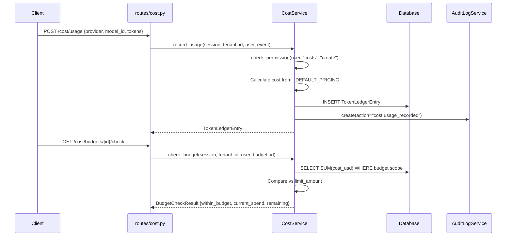

# 06 — Cost Engine Flow

## Overview
Enterprise cost tracking with immutable token ledger, per-provider pricing (GPT-4o, Claude, Gemini), budget enforcement, chargeback reports, and cost forecasting.

## Trigger
| Method | Path | Handler |
|--------|------|---------|
| `POST` | `/cost/usage` | `routes/cost.py` — record usage |
| `POST` | `/cost/calculate` | `routes/cost.py` — estimate cost |
| `GET`  | `/cost/summary` | `routes/cost.py` — cost summary |
| `POST` | `/cost/budgets` | `routes/cost.py` — create budget |
| `GET`  | `/cost/budgets/{id}/check` | `routes/cost.py` — budget check |
| `GET`  | `/cost/chargeback` | `routes/cost.py` — chargeback report |
| `GET`  | `/cost/forecast` | `routes/cost.py` — cost forecast |

## Services
**File:** `services/cost_service.py` — `CostService`

### Recording Usage
- RBAC: `check_permission(user, "costs", "create")` or finance role
- Creates `TokenLedgerEntry` with full attribution (provider, model_id, input_tokens, output_tokens, cost_usd, agent_id, user_id, department_id)
- Audit logged via `AuditLogService`

### Default Pricing
Per-1M-token rates (input, output):
| Provider | Model | Input | Output |
|----------|-------|-------|--------|
| OpenAI | gpt-4o | $2.50 | $10.00 |
| OpenAI | gpt-4o-mini | $0.15 | $0.60 |
| Anthropic | claude-3-5-sonnet | $3.00 | $15.00 |
| Anthropic | claude-3-opus | $15.00 | $75.00 |
| Google | gemini-1.5-pro | $3.50 | $10.50 |
| Google | gemini-2.0-flash | $0.10 | $0.40 |

### Budget Enforcement
- `BudgetCheckResult` — compares current spend vs. `limit_amount`
- Scope: department, user, or agent level
- Alerts when thresholds exceeded

### Chargeback & Forecasting
- `ChargebackReport` with `ChargebackLineItem` per department
- `CostForecast` with `DailyProjection` for trend-based estimation

## Data Transformations

```
Input:  RecordUsageRequest { provider, model_id, input_tokens, output_tokens, ... }
  ↓
Pricing: _DEFAULT_PRICING[provider][model_id] → (input_rate, output_rate)
  ↓
Cost:   (input_tokens/1M × input_rate) + (output_tokens/1M × output_rate) = cost_usd
  ↓
Ledger: TokenLedgerEntry { id, tenant_id, cost_usd, attribution chain }
  ↓
Output: CostSummary | BudgetCheckResult | ChargebackReport | CostForecast
```

## Mermaid Sequence Diagram


