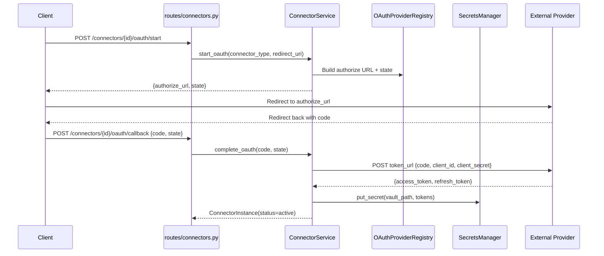

# 07 — Connector Hub Flow

## Overview
Enterprise connector management with OAuth 2.0 flows, Vault-backed credential storage, connection testing, health monitoring, and a plugin-based adapter framework.

## Trigger
| Method | Path | Handler |
|--------|------|---------|
| `POST` | `/connectors/` | `routes/connectors.py` — create connector |
| `GET`  | `/connectors/types` | list connector types |
| `POST` | `/connectors/{id}/oauth/start` | start OAuth flow |
| `POST` | `/connectors/{id}/oauth/callback` | complete OAuth |
| `POST` | `/connectors/{id}/test` | test connection |
| `GET`  | `/connectors/{id}/health` | health check |

## Connector Types (Built-in)
**File:** `services/connector_service.py`

| Name | Category | Auth Methods |
|------|----------|-------------|
| salesforce | CRM | OAuth2 |
| s3 | Storage | API_KEY, Service Account |
| slack | Communication | OAuth2 |
| postgresql | Database | Basic, Service Account |
| bigquery | Analytics | Service Account |
| github | DevTools | OAuth2, API_KEY |

## OAuth Flow
**File:** `services/connector_service.py`

1. **Start** — `OAuthFlowStart`: generate `state` param, build authorize URL with scopes
2. **Redirect** — user authenticates with provider
3. **Callback** — exchange `code` for tokens at provider's `token_url`
4. **Store** — credentials saved to Vault at `_vault_path(tenant_id, connector_type)`

OAuth provider endpoints (`_OAUTH_PROVIDERS`):
- Salesforce: `login.salesforce.com/services/oauth2/authorize`
- Slack: `slack.com/oauth/v2/authorize`
- GitHub: `github.com/login/oauth/authorize`

## Credential Storage
All secrets stored in Vault via `SecretsManager`:
- Path: `connectors/{tenant_id}/{connector_type}/credentials`
- Secret fields identified by `get_secret_field_names()`
- Never exposed in API responses

## Services
| Service | File |
|---------|------|
| `ConnectorService` (enterprise) | `services/connector_service.py` |
| `OAuthProviderRegistry` | `services/connectors/oauth.py` |
| `ConnectionTester` | `services/connectors/testers.py` |
| `HealthChecker` | `services/connectors/health.py` |
| Schema registry | `services/connectors/schemas.py` |

## Mermaid Sequence Diagram

