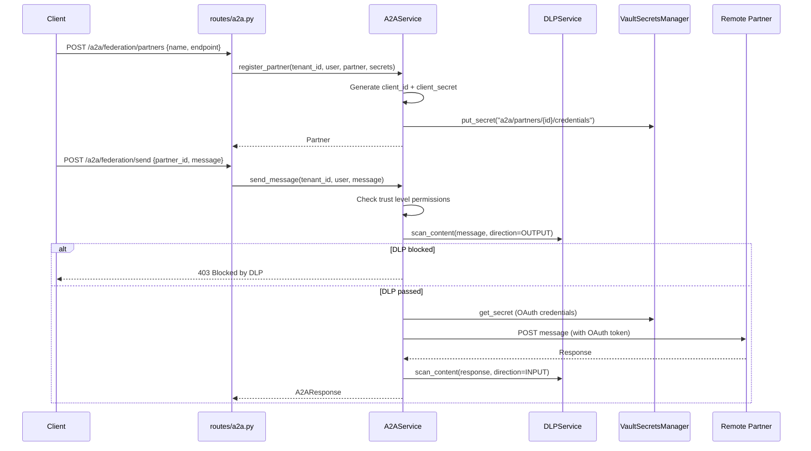

# 08 — A2A (Agent-to-Agent) Protocol Flow

## Overview
Federated A2A protocol enabling cross-organization agent communication with OAuth client credentials, mTLS, DLP scanning on all data flows, partner trust management, and agent card discovery.

## Trigger
| Method | Path | Handler |
|--------|------|---------|
| `POST` | `/a2a/cards` | register agent card |
| `GET`  | `/a2a/cards` | discover agent cards |
| `POST` | `/a2a/tasks` | create outbound task |
| `POST` | `/a2a/federation/partners` | register partner |
| `POST` | `/a2a/federation/send` | send federated message |

## Agent Cards
**File:** `models/a2a.py` — `A2AAgentCard`
- Fields: `name`, `url`, `version`, `capabilities: list[str]`, `skills: list[dict]`, `auth_schemes: list[str]`, `agent_id`, `is_active`
- Published via `/a2a/cards` for discovery

## Federation Service
**File:** `services/a2a_service.py` — `A2AService`

### Partner Registration
1. Generate `client_id` = `a2a-{partner_id[:12]}`, `client_secret` = random
2. Store in Vault: `a2a/partners/{partner_id}/credentials`
3. Return `Partner` with trust level and metadata

### Trust Levels
| Level | Permitted Operations |
|-------|---------------------|
| `UNTRUSTED` | discover |
| `VERIFIED` | discover, send_message |
| `TRUSTED` | discover, send_message, receive_message, publish |
| `FEDERATED` | discover, send_message, receive_message, publish, delegate |

### DLP Scanning
All inbound/outbound A2A messages are DLP-scanned via `DLPService`:
- Uses `ScanDirection.INPUT` for inbound, `ScanDirection.OUTPUT` for outbound
- Blocks sensitive data from leaving tenant boundary

## Services
| Service | File |
|---------|------|
| `A2AService` | `services/a2a_service.py` |
| `A2AClient`, `A2APublisher` | `services/a2a.py` |
| `DLPService` | `services/dlp_service.py` |
| `VaultSecretsManager` | `secrets/manager.py` |

## Mermaid Sequence Diagram

