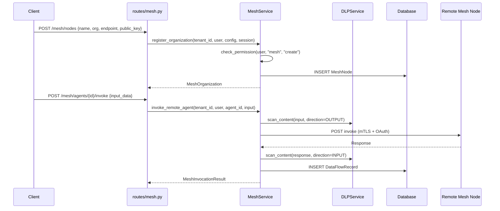

# 09 — Agent Mesh Flow

## Overview
Federated mesh network for cross-organization agent collaboration with organization registration, trust relationships, DLP-scanned data flows, topology management, and compliance reporting.

## Trigger
| Method | Path | Handler |
|--------|------|---------|
| `POST` | `/mesh/nodes` | register mesh node |
| `POST` | `/mesh/trust` | establish trust |
| `POST` | `/mesh/messages` | send mesh message |
| `POST` | `/mesh/federation` | create federation agreement |
| `POST` | `/mesh/agents/{id}/share` | share agent to mesh |
| `POST` | `/mesh/agents/{id}/invoke` | invoke remote agent |

## MeshService
**File:** `services/mesh_service.py` — `MeshService`

### Organization Registration
1. `register_organization(tenant_id, user, org_config, session)`
2. RBAC: `check_permission(user, "mesh", "create")`
3. Creates `MeshNode` with: name, organization, endpoint_url, public_key
4. Stores metadata with tenant_id, metadata_url
5. Audit logged via `AuditLogService`

### Trust Relationships
- `TrustLevel` enum: manages inter-org trust
- `TrustRelationship` links two nodes with allowed data categories
- Cross-org data flows are DLP-scanned before transit

### Topology
- `MeshTopology` with `MeshTopologyNode` and `MeshTopologyEdge`
- Visual representation of mesh network
- `ComplianceReport` for data flow auditing

## Models
**File:** `models/mesh.py`

| Model | Purpose |
|-------|---------|
| `MeshNode` | Node in the mesh network |
| `MeshOrganization` | Registered org |
| `TrustRelationship` | Trust between orgs |
| `FederationAgreement` | Formal federation terms |
| `SharedAgent` | Agent published to mesh |
| `MeshMessage` | Inter-node message |
| `DataFlowRecord` | Audit trail for data movement |

## Mermaid Sequence Diagram

