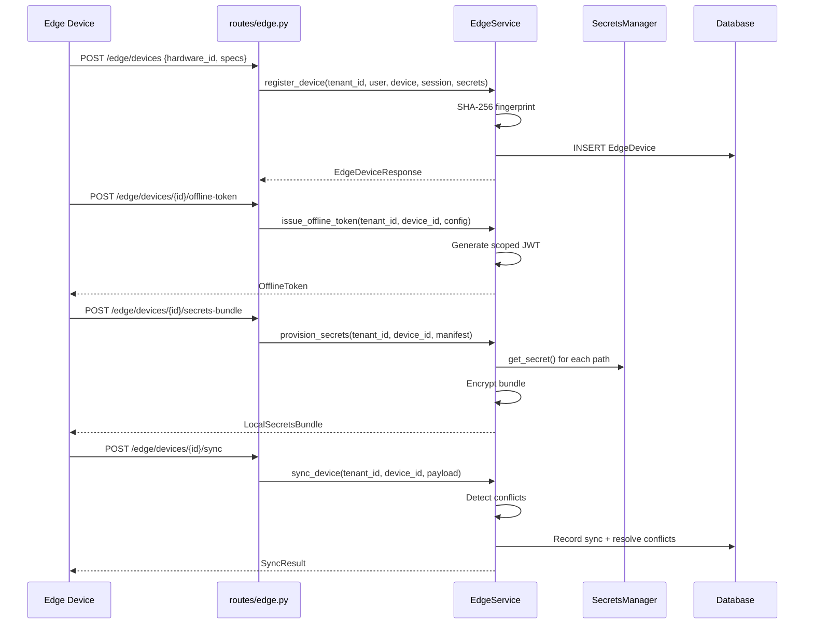

# 10 — Edge Runtime Flow

## Overview
Edge device management with device registration, offline JWT tokens, local secrets bundles via Vault, bidirectional sync with conflict resolution, OTA updates, fleet analytics, and remote command execution.

## Trigger
| Method | Path | Handler |
|--------|------|---------|
| `POST` | `/edge/devices` | register device |
| `POST` | `/edge/devices/{id}/heartbeat` | device heartbeat |
| `POST` | `/edge/devices/{id}/deploy-model` | deploy model |
| `POST` | `/edge/devices/{id}/offline-token` | issue offline token |
| `POST` | `/edge/devices/{id}/sync` | bidirectional sync |
| `POST` | `/edge/devices/{id}/secrets-bundle` | provision secrets |
| `POST` | `/edge/updates` | push OTA update |

## EdgeService
**File:** `services/edge_service.py` — `EdgeService`

### Device Registration
1. Generate `device_fingerprint` = SHA-256 of `"{tenant_id}:{hardware_id}"`
2. Create `EdgeDevice` with hardware specs (cpu_cores, memory_mb, disk_mb, gpu)
3. Audit: `edge.device.registered`

### Offline Auth
- `OfflineToken` with configurable TTL, scoped to device + tenant
- Enables edge operation when cloud connectivity lost

### Local Secrets
- `LocalSecretsBundle` provisioned from Vault
- Encrypted bundle pushed to device
- `SecretsManifest` tracks which secrets are deployed

### Sync Protocol
- `SyncPayload` for bidirectional data exchange
- `SyncConflict` detection and resolution
- `EdgeSyncRecord` for audit trail

## Models
**File:** `models/edge.py`

| Model | Purpose |
|-------|---------|
| `EdgeDevice` | Registered device with hardware specs |
| `OfflineToken` | JWT for offline operation |
| `LocalSecretsBundle` | Vault secrets for edge |
| `EdgeSyncRecord` | Sync audit trail |
| `OTAUpdate` | Over-the-air update manifest |
| `FleetAnalytics` | Fleet-wide metrics |

## Mermaid Sequence Diagram

