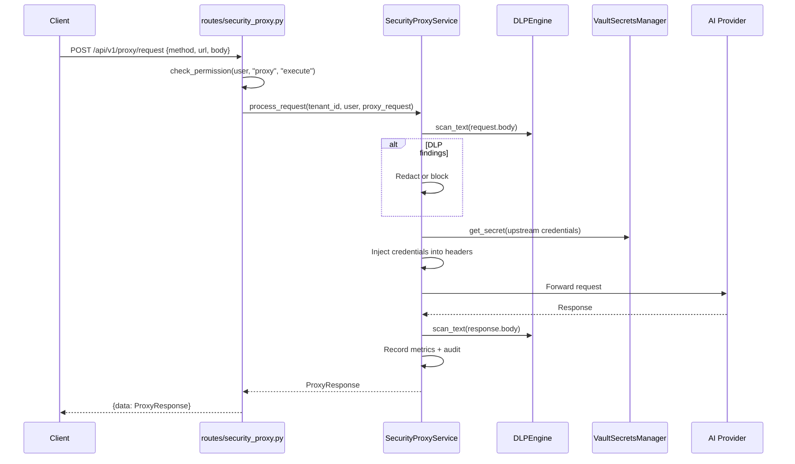

# 11 — Security Proxy Flow

## Overview
Cross-platform security proxy gateway providing SAML termination, Vault-backed credential injection, DLP scanning on request/response, upstream routing, content classification, and full audit logging.

## Trigger
| Method | Path | Handler |
|--------|------|---------|
| `POST` | `/api/v1/proxy/request` | `security_proxy.py::proxy_request` |
| `POST` | `/api/v1/proxy/saml/terminate` | SAML termination |
| `POST` | `/api/v1/proxy/upstreams` | register upstream |
| `POST` | `/api/v1/proxy/classify` | classify content |
| `GET`  | `/api/v1/proxy/metrics` | proxy metrics |

## SecurityProxyService
**File:** `services/security_proxy_service.py`

### Full Pipeline (`process_request`)
1. **Validate tenant scope**
2. **DLP scan request body** — `DLPEngine.scan_text()` on request content
3. **Resolve upstream** — match URL to `UpstreamConfig`, inject credentials from Vault
4. **Forward request** (simulated in current impl)
5. **DLP scan response body** — scan LLM output
6. **Record metrics** — latency, token counts
7. **Audit log** — full request/response audit trail

### SAML Termination
- Parses SAML Response XML (namespaces: `urn:oasis:names:tc:SAML:2.0:protocol`, `urn:oasis:names:tc:SAML:2.0:assertion`)
- Extracts assertions and creates proxy session
- IdP certificate fetched from Vault: `saml/idp/{cert_path}`

### Credential Injection
- Upstream credentials stored at `proxy/upstreams/{upstream_id}/credentials`
- Injected into forwarded request headers (e.g., `Authorization: Bearer ...`)

### Content Classification
- Topic keywords: code_generation, data_analysis, summarization, translation, creative_writing
- Sensitivity keywords: restricted (SSN, credit card), confidential (salary, API key), internal

## Mermaid Sequence Diagram

