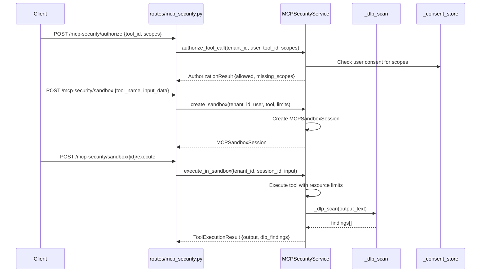

# 12 — MCP Security Flow

## Overview
MCP (Model Context Protocol) Security Guardian providing OAuth-scoped tool authorization, sandboxed execution with resource limits, DLP scanning on tool outputs, consent management, security scoring, version tracking, and emergency kill switch.

## Trigger
| Method | Path | Handler |
|--------|------|---------|
| `POST` | `/mcp-security/authorizations` | create authorization policy |
| `POST` | `/mcp-security/authorize` | check tool authorization |
| `POST` | `/mcp-security/sandbox` | create sandbox session |
| `POST` | `/mcp-security/sandbox/{id}/execute` | execute in sandbox |
| `GET`  | `/mcp-security/tools/{id}/score` | security score |
| `POST` | `/mcp-security/consent` | manage consent |

## MCPSecurityService
**File:** `services/mcp_security_service.py`

### Tool Authorization (OAuth Scopes)
`authorize_tool_call(tenant_id, user, tool_id, scopes)`
1. Check user has consented to required OAuth scopes
2. Lookup consent in `_consent_store[tenant_id][user_id][tool_id]`
3. Return `AuthorizationResult` with allowed/denied + missing scopes

### Sandboxed Execution
1. Create `MCPSandboxSession` with resource limits (CPU, memory, timeout)
2. Execute tool in isolated context
3. DLP scan output: `_dlp_scan(text)` checks for SSN, credit cards, emails, AWS keys, private keys
4. Return `ToolExecutionResult` with findings

### Security Scoring
`SecurityScore` with factors:
- `SecurityScoreFactor` per dimension (auth, DLP, permissions, versioning)
- Composite score 0-100

### Version Tracking
- `MCPToolVersion` tracks tool definition changes
- `ToolVersionDiff` compares versions
- SHA-256 hash of definition for change detection

### DLP Patterns (service-level)
| Pattern | Regex |
|---------|-------|
| ssn | `\b\d{3}-\d{2}-\d{4}\b` |
| credit_card | `\b(?:\d[ -]*?){13,19}\b` |
| email_pii | `\b[A-Za-z0-9._%+-]+@...` |
| aws_key | `\b(?:AKIA\|ABIA\|ACCA\|ASIA)[0-9A-Z]{16}\b` |
| private_key | `-----BEGIN (?:RSA \|EC )?PRIVATE KEY-----` |

## Models
**File:** `models/mcp_security.py`

| Model | Purpose |
|-------|---------|
| `MCPToolAuthorization` | Per-tool auth policy |
| `MCPToolDefinition` | Tool schema definition |
| `MCPSandboxSession` | Ephemeral sandbox |
| `MCPSecurityEvent` | Security event log |
| `AuthorizationResult` | Auth check result |
| `SecurityScore` | Composite security score |
| `MCPToolVersion` | Version tracking |

## Mermaid Sequence Diagram

